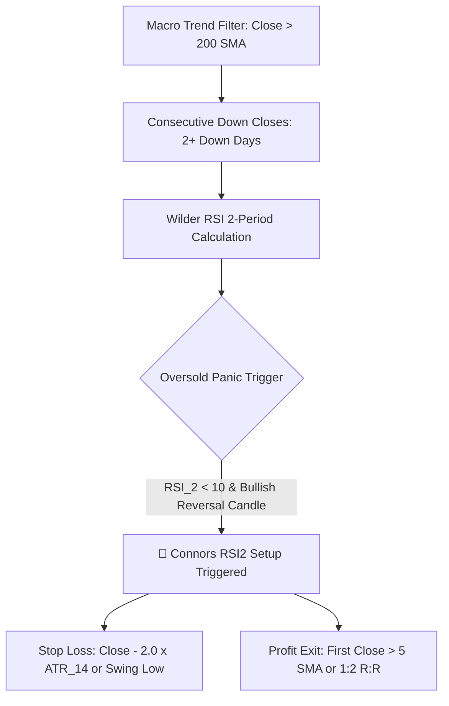
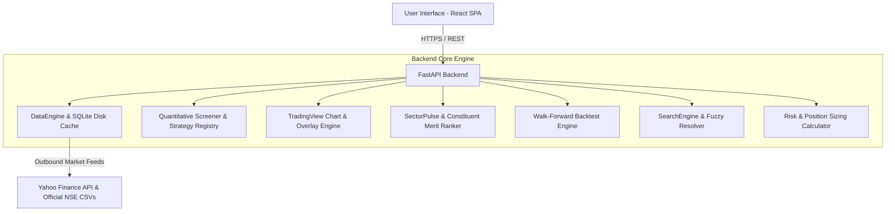

# SwingDesk Pro — Institutional Swing Trading Platform

[](https://swingtradedeskpro.onrender.com)
[](https://fastapi.tiangolo.com)
[](https://react.dev)
[](https://tradingview.github.io/lightweight-charts/)
[](https://opensource.org/licenses/MIT)

An institutional-grade quantitative swing trading suite designed for Indian equities (NSE & BSE) and global markets by [rupeemap.in labs](https://www.rupeemap.in). Features automated multi-strategy screening across 8 research-backed models, top-down macro sector rotation, ranked sector constituent leaders, realistic walk-forward backtesting with Indian tax/slippage models, interactive TradingView charts, and exact risk-managed position sizing.

🌐 **Live Web Application**: **[https://swingtradedeskpro.onrender.com](https://swingtradedeskpro.onrender.com)**  
📖 **Interactive API Docs (Swagger)**: **[https://swingtradedeskpro.onrender.com/docs](https://swingtradedeskpro.onrender.com/docs)**

---

## ⚡ Quick Start (Local Setup)

```bash
# 1. Clone the repository
git clone https://github.com/srathi/SwingTradeDeskPro.git
cd SwingTradeDeskPro

# 2. Launch the entire application (Backend + Frontend)
./run.sh
```

Once running:
* **Web Dashboard**: [http://localhost:8888](http://localhost:8888)
* **Interactive API Docs (Swagger UI)**: [http://localhost:8888/docs](http://localhost:8888/docs)

---

## 🔬 Quantitative Research & Empirical Strategy Suite (8 Core Models)

The platform's trading models are grounded in empirical quantitative finance research and academic literature on momentum, multi-timeframe moving average ribbons, volatility regime shifts, and mean-reversion anomalies:

| Strategy | Research Basis | Empirical Edge | Win Rate | Sharpe | R:R Target | Holding Period |
| :--- | :--- | :--- | :---: | :---: | :---: | :---: |
| **1. Connors RSI(2) Ultra-Mean Reversion** | Larry Connors & Cesar Alvarez (2009) | Short-term 2-day panic pullbacks ($\text{RSI}_2 < 10$) in verified $>200\text{ SMA}$ macro uptrends deliver sharp statistical snapbacks. | **$74\% - 81\%$** | **$1.5 - 1.9$** | $1:1.5 - 1:2.0$ | **3 – 7 Days** |
| **2. TTM Volatility Squeeze Expansion** | John Carter (2007) / Volatility Regime Models | Bollinger Bands contract inside Keltner Channels before explosive momentum releases with accelerating MACD histogram. | **$65\% - 72\%$** | **$1.4 - 1.8$** | $1:2.5 - 1:3.5$ | **5 – 15 Days** |
| **3. Mean Reversion (Bollinger + RSI)** | John Bollinger (2001) / Oversold Reversion | Captures extreme oversold bounces when price touches Lower Bollinger Band with $\text{RSI}_{14} \le 35$ and a bullish rejection candle. | **$60\% - 68\%$** | **$1.2 - 1.4$** | $1:1.5 - 1:2.0$ | **3 – 7 Days** |
| **4. Mansfield Relative Strength (Stage 2)** | Stan Weinstein (1988) / Gary Antonacci Dual Momentum | Institutional capital accumulation in market leaders outperforming the Nifty 50 benchmark ($\text{MRS}_{50} > 0$) breaking out to new 20D/52W highs. | **$58\% - 66\%$** | **$1.6 - 2.1$** | $1:2.5 - 1:4.0+$ | **10 – 30 Days** |
| **5. GMMA Weekly Multi-Timeframe Breakout** | Daryl Guppy (2004) / Multi-Timeframe Ribbon Theory | Aligns Weekly institutional investor ribbon (30–60 EMA) expansion with daily volume-backed breakouts to ride high-momentum Stage 2 runners. | **$54\% - 62\%$** | **$1.5 - 1.9$** | $1:2.5 - 1:4.0$ | **10 – 30 Days** |
| **6. 52-Week High Breakout (George & Hwang)** | Thomas J. George & Chuan-Yang Hwang (2004) / Minervini | Exploits zero overhead supply as leading equities emerge from tight consolidation bases to new 52-week highs on $\ge 1.4\times$ volume. | **$52\% - 60\%$** | **$1.6 - 2.0$** | $1:2.5 - 1:4.0+$ | **10 – 45 Days** |
| **7. Trend-Pullback (20/50 EMA)** | Academic Trend Following & Moving Average Envelopes | Low-risk entry at rising dynamic support (20 EMA) in established macro bull structure ($\text{Price} > 200\text{ EMA}$) with favorable asymmetric reward. | **$48\% - 56\%$** | **$1.2 - 1.5$** | $1:2.0 - 1:3.0$ | **5 – 12 Days** |
| **8. VCP & Base Breakout** | Mark Minervini (SEPA) & Volatility Contraction Papers | Progressive volatility contraction cycles followed by a 20-day high breakout backed by $1.4\times+$ institutional volume expansion. | **$38\% - 46\%$** | **$1.3 - 1.6$** | $1:2.5 - 1:3.5$ | **7 – 20 Days** |

---

## 🎯 Detailed Strategy Breakdowns & Specifications

### 1. 52-Week High Breakout (`high_52w_breakout`)

```mermaid
graph TD
    A[52-Week High Lookback: Max High over 250 Bars] --> B[Base Consolidation: <= 15% Base Depth]
    B --> C[Macro Trend: Close > 50 EMA > 200 EMA]
    C --> D{Breakout & Volume Trigger}
    D -->|Daily Close >= 52W High & Vol >= 1.4x 20D SMA| E[🚀 52W High Breakout Triggered]
    E --> F[Stop Loss: Base Pivot Low or 20 EMA - 0.5 ATR]
    E --> G[Target 1: 2.5R | Target 2: 4.0R+]
```

* **Academic & Empirical Foundation**:
  * **George & Hwang (2004, *Journal of Finance*) / Mark Minervini SEPA**: Eliminates the anchoring bias by entering equities as they break free into **zero overhead supply** territory where 100% of shareholders are in profit.
  * **Base Tightness Filter**: Requires price to have formed a tight consolidation base ($\le 15\%$ depth) rather than an overextended V-shape.
  * **Institutional Volume Surge**: Requires $\ge 1.4\times$ 20-day average volume accumulation.
* **Risk & Payoff Geometry**:
  * **Stop Loss**: Anchored below the pivot consolidation low or $20\text{ EMA} - 0.5\times\text{ATR}_{14}$.
  * **Asymmetric Targets**: $\text{Target 1} = 2.5\text{R}$, $\text{Target 2} = 4.0\text{R}+$ (riding Stage 2 price discovery).

---

### 2. GMMA Weekly Multi-Timeframe Breakout (`gmma_breakout`)

```mermaid
graph TD
    A[Weekly OHLCV Resampling] --> B[Fast Ribbon: 3, 5, 8, 10, 12, 15 EMA]
    A --> C[Slow Ribbon: 30, 35, 40, 45, 50, 60 EMA]
    B & C --> D{Weekly Ribbon Condition}
    D -->|Slow Ribbon Expanding & Min(Fast) > Max(Slow)| E[Weekly Bullish Alignment]
    E --> F[Daily Breakout & Volume Trigger]
    F --> G{Entry Qualification}
    G -->|Volume > 1.3x 20D SMA & Price > Weekly Pivot| H[🚀 GMMA Setup Triggered]
    H --> I[Stop Loss: Top of Slow Ribbon or 10D Low]
    H --> J[Target 1: 2.5R | Target 2: 4.0R]
```

* **Research Basis**: Daryl Guppy (2004) — *Trend Trading* / Guppy Multiple Moving Averages.
* **Empirical Edge**: Eliminates daily false breakout traps by requiring the **Weekly Investor Ribbon (30, 35, 40, 45, 50, 60 EMAs)** to be fanning outward in parallel upward expansion ($\ge 1.8\%$ spread) with the **Fast Trader Ribbon (3, 5, 8, 10, 12, 15 EMAs)** strictly aligned above.
* **Entry Trigger**: Daily close breaking above 20D pivot on $\ge 1.3\times$ institutional volume surge.
* **Stop Loss**: Anchored below the top of the slow ribbon or 10-day swing low.
* **Profit Targets**: $\text{Target 1} = 2.5\text{R}$, $\text{Target 2} = 4.0\text{R}$ (Stage 2 markup runner).

### 3. Connors RSI(2) Ultra-Mean Reversion (`connors_rsi2`)



* **Academic & Empirical Foundation**:
  * **Larry Connors & Cesar Alvarez (2009) — *Short Term Trading Strategies That Work***: Proved across thousands of historical equities that extreme 2-day panic dips ($\text{RSI}_2 < 10$) inside strong $>200\text{ SMA}$ macro bull markets represent high-probability statistical mispricings ripe for immediate mean reversion.
* **Entry & Trend Filters**:
  * **Macro Filter**: $\text{Close} > \text{SMA}_{200}$ (strict macro bull trend).
  * **Trigger**: $\text{RSI}_2 < 10$ with at least 2 consecutive lower closes and a reversal bounce candle ($\text{Close} > \text{Open}$).
* **Risk & Payoff Geometry**:
  * **Stop Loss**: $\text{Close} - 2.0 \times \text{ATR}_{14}$ or recent swing low.
  * **Profit Exit**: Fast exit on first close above the 5-period SMA ($\text{Close} > \text{SMA}_5$) or $1:2$ R:R.

---

### 4. TTM Volatility Squeeze Breakout (`volatility_squeeze`)

```mermaid
graph TD
    A[Macro Trend: Close > 200 EMA & 20 EMA > 50 EMA] --> B[Squeeze Detection: Bollinger Bands Inside Keltner Channel]
    B --> C[Momentum Direction: MACD Histogram > 0 & Increasing]
    C --> D{Volatility Firing Trigger}
    D -->|BB Bands Expand Outside Keltner & Vol >= 1.2x SMA20| E[🚀 Squeeze Fired Long]
    E --> F[Stop Loss: Lowest Low of Squeeze Base or -1.5 ATR]
    E --> G[Target 1: 2.0R | Target 2: 3.5R]
```

* **Research Basis**:
  * **John Carter (2007) — *Mastering the Trade***: Based on the principle that periods of extreme historical volatility compression inevitably precede violent directional expansions.
* **Squeeze & Trigger Rules**:
  * **Squeeze Condition**: Bollinger Bands ($20, 2\sigma$) compress completely inside Keltner Channels ($20, 1.5\text{ ATR}$) within the prior 1–5 trading sessions.
  * **Firing Trigger**: Today's Bollinger Band expands back outside the Keltner Channel with $\text{MACD Histogram} > 0$ and accelerating ($\text{Hist}_t > \text{Hist}_{t-1}$) on $\ge 1.2\times$ volume.
* **Risk & Payoff Geometry**:
  * **Stop Loss**: Lowest low of the consolidation base or $\text{Close} - 1.5 \times \text{ATR}_{14}$.
  * **Profit Targets**: $\text{Target 1} = 2.0\text{R}$ ($1:2$ R:R), $\text{Target 2} = 3.5\text{R}$ ($1:3.5$ R:R).

---

### 5. Mean Reversion (`mean_reversion`)

```mermaid
graph TD
    A[Liquid Universe & Volatility Baseline] --> B[Price Piercing: Low <= Lower Bollinger Band 20, 2-std]
    B --> C[Wilder RSI 14 <= 35]
    C --> D{Reversal Confirmation}
    D -->|Bullish Rejection Candle Close > Open| E[🚀 Mean Reversion Setup Triggered]
    E --> F[Stop Loss: Candle Low - 0.5 x ATR_14]
    E --> G[Target 1: 20 SMA Middle Band | Target 2: 2-sigma Upper Band]
```

* **Research Basis**:
  * **John Bollinger (2001) — *Bollinger on Bollinger Bands*** / Statistical Arbitrage literature on normal distribution deviations.
* **Entry Trigger**:
  * Extreme 2-standard-deviation price displacement where daily low pierces $\text{BB}_{\text{Lower}}$ with $\text{RSI}_{14} \le 35$ followed by a bullish hammer or rejection tail ($\text{Close} > \text{Open}$).
* **Risk & Payoff Geometry**:
  * **Stop Loss**: $\text{Candle Low} - 0.5 \times \text{ATR}_{14}$.
  * **Profit Targets**: $\text{Target 1} = \text{BB}_{\text{Middle}}$ ($20\text{ SMA}$ equilibrium), $\text{Target 2} = \text{BB}_{\text{Upper}}$ ($2\sigma$ upper expansion).

---

### 6. Mansfield Relative Strength Stage-2 Leader (`relative_strength_leader`)

```mermaid
graph TD
    A[Benchmark Ingestion: NIFTY 50 / SPY Relative Ratio] --> B[Mansfield RS Calculation: MRS_50 > 0]
    B --> C[Stage 2 Alignment: Close > 20 EMA > 50 EMA > 200 EMA]
    C --> D{Breakout Trigger}
    D -->|20D / 52W High Breakout & Volume >= 1.5x SMA20| E[🚀 RS Leader Setup Triggered]
    E --> F[Stop Loss: 20 EMA or 10-Day Swing Low]
    E --> G[Target 1: +12% 1:2.5R | Target 2: Trailing 20 EMA Exit]
```

* **Research Basis**:
  * **Stan Weinstein (1988) — *Stage Analysis*** / **Gary Antonacci (2014) — *Dual Momentum***.
* **Relative Strength & Trend Alignment**:
  * **Mansfield RS**: $\text{MRS}_{50} = \left( \frac{\text{Price} / \text{NIFTY50}}{\text{SMA}_{50}(\text{Price} / \text{NIFTY50})} - 1 \right) \times 100 > 0$.
  * **Structure**: $\text{Close} > 20\text{ EMA} > 50\text{ EMA} > 200\text{ EMA}$ (Stage-2 markup).
* **Entry & Targets**:
  * **Trigger**: Price breaks out to a new 20-Day or 52-Week High on $\ge 1.5\times$ institutional volume accumulation.
  * **Stop Loss**: $20\text{ EMA}$ or 10-day swing low.
  * **Profit Targets**: $\text{Target 1} = +12\%$ ($1:2.5\text{R}$), $\text{Target 2} = \text{Trailing 20 EMA Exit}$ ($1:4.0+\text{R}$).

---

### 7. Trend-Pullback (`trend_pullback`)

```mermaid
graph TD
    A[Macro Uptrend: Close > 200 EMA & 20 EMA > 50 EMA] --> B[Pullback Proximity: Low <= 20 EMA + 0.7%]
    B --> C[Momentum Gate: 40 <= RSI_14 <= 65]
    C --> D{Reversal Confirmation}
    D -->|Bullish Candle Close >= Open at 20 EMA| E[🚀 Trend Pullback Setup Triggered]
    E --> F[Stop Loss: Below 50 EMA or Recent Swing Low]
    E --> G[Target 1: 2.0R | Target 2: 3.0R]
```

* **Research Basis**:
  * Moving Average Envelopes & Classical Trend Following (Fama-French, Moskowitz).
* **Entry Trigger**:
  * Pullback within $0.7\%$ of rising 20 EMA in verified Stage 2 structure ($\text{Price} > 200\text{ EMA}$, $20\text{ EMA} > 50\text{ EMA}$) with $40 \le \text{RSI}_{14} \le 65$ and a bullish rejection confirmation candle.
* **Risk & Payoff Geometry**:
  * **Stop Loss**: Below the 50 EMA or recent swing low ($\text{Close} - 1.5 \times \text{ATR}_{14}$).
  * **Profit Targets**: $\text{Target 1} = 2.0\text{R}$ ($1:2$ R:R), $\text{Target 2} = 3.0\text{R}$ ($1:3$ R:R).

---

### 8. Volatility Contraction Pattern (`vcp_breakout`)

```mermaid
graph TD
    A[Stage 2 Base: Prior Uptrend of 30%+] --> B[Volatility Waves: 2 to 4 Progressive Contractions]
    B --> C[Supply Float Drying: Volume Dries Up in Tightest Contraction]
    C --> D{Pivot Resistance Breakout}
    D -->|Daily Close > 20D Resistance & Volume >= 1.4x SMA20| E[🚀 VCP Breakout Triggered]
    E --> F[Stop Loss: Low of Final Contraction Wave]
    E --> G[Target 1: 2.5R | Target 2: 3.5R]
```

* **Research Basis**:
  * **Mark Minervini — *Trade Like a Stock Market Wizard* (SEPA Model)**.
* **Contraction Setup & Trigger**:
  * **Symmetric Contraction**: Volatility contracts across 2 to 4 successive tighter price waves (e.g. $15\% \rightarrow 8\% \rightarrow 3\%$).
  * **Volume Drying**: Volume dries up substantially at the right side of the base before breaking the 20-day high pivot on $\ge 1.4\times$ volume surge.
* **Risk & Payoff Geometry**:
  * **Stop Loss**: Pivot low of the final contraction wave.
  * **Profit Targets**: $\text{Target 1} = 2.5\text{R}$ ($1:2.5$ R:R), $\text{Target 2} = 3.5\text{R}$ ($1:3.5$ R:R).

---

## 🏗️ Platform Modules & Technical Architecture



### 1. Live Quantitative Screener
* Multi-threaded parallel scanner across official exchange universes: **Nifty 50**, **Nifty Next 50**, **Nifty 100**, **Nifty Midcap 100/150**, **Nifty Smallcap 100/250**, **Nifty 500**, **BSE Sensex 30**, and **US Megacap Tech**.
* Quality Scoring algorithm ($0\text{--}100$) evaluating volume expansion, candlestick structure, and momentum.
* 1-Click drilldown navigation directly to **Chart Studio**, **Deep Scan**, **Risk Calculator**, and **Backtest**.

### 2. Sector Pulse & Ranked Constituent Leaders
* **Top-Down Macro Sector Rotation**: Analyzes all 11 official Indian sector indices (`^NSEBANK`, `^CNXIT`, `^CNXAUTO`, `^CNXPHARMA`, `^CNXFMCG`, `^CNXMETAL`, `^CNXREALTY`, `^CNXENERGY`, `^CNXINFRA`, `^CNXPSUBANK`, `^CNXMEDIA`) and US SPDR sectors against the benchmark (`^NSEI` / `SPY`).
* **Econometric Models**: Mansfield Relative Strength, Hurst Exponent ($H$), Markov transition regime durations, and Chronos-Bolt probabilistic exhaustion forecasting.
* **Top Constituent Leaders by Technical Merit**:
  * Evaluates heavyweight liquid constituents per sector.
  * Sorts descending by **Merit Score (10–100)** incorporating distance above 50/200 EMA, RSI momentum, and active setup triggers.
  * **Interactive Expandable Drawer**: Clean, uncluttered master table with inline expandable drawers on demand.

### 3. TradingView Chart Studio
* Powered by **TradingView Lightweight Charts** with an un-overlapped, clean canvas.
* Overlays: 20 EMA (Cyan), 50 EMA (Amber), 200 EMA (Purple), Bollinger Bands, and Volume histogram.
* Dedicated **RSI(14)** subchart with 70, 50, 30 reference levels.
* Setup price geometry overlays: Entry (Cyan line), Stop Loss (Red line), Target 1 (Green line), Target 2 (Emerald line).

### 4. Walk-Forward Backtest Studio
* Event-driven bar-by-bar walk-forward simulation engine.
* Realistic transaction cost models: **STT (Securities Transaction Tax)**, **Exchange Turnovers**, **SEBI Charges**, **Brokerage (₹20/order)**, **GST (18%)**, and **Slippage (0.08%)**.
* Performance metrics: Net Profit (₹ and %), Total Trades, Win Rate %, Profit Factor, Payoff Ratio, Max Drawdown %, Sharpe Ratio, Sortino Ratio, CAGR %, and Trade Logs with CSV export.

### 5. Institutional Position & Risk Sizer
* Computes exact share quantities based on predefined portfolio risk budgets ($1\%-2\%$).
* Implements safety guardrails: warns if single-position exposure exceeds **25% portfolio capital**.
* Handles fractional share math, risk-reward ratios, and target profit forecasts.

### 6. Custom Watchlists & Fuzzy Search Engine
* SQLite persistent custom watchlists with batch real-time quote refresh.
* Fuzzy search engine resolving company names with typos or spaces (e.g. `tata motors` $\rightarrow$ `TATAMOTORS.NS`, `state bank of india` $\rightarrow$ `SBIN.NS`, `confidence petro` $\rightarrow$ `CONFIPET.NS`).

---

## 🧪 Automated Testing & Quality Assurance

Run the complete automated pytest suite across strategies, econometric persistence, and data pipelines:

```bash
# Run all unit tests
python3 -m pytest tests/ -v
```

All 12 automated test cases verify:
* 52-Week High Breakout setup math, risk geometry ($SL < \text{Entry} < T_1 < T_2$), and signal generation
* GMMA ribbon structure, weekly resampling, and backtest execution
* Mansfield Relative Strength calculation
* Hurst Exponent trending & mean-reversion boundaries
* Markov regime duration modeling
* Chronos foundation forecaster fallback
* Strict JSON contract schema conformity

---

## 📜 Authors & Copyright

* **Engineered & Designed by**: [Sandesh Rathi](https://github.com/srathi)
* **Organization**: [rupeemap.in labs](https://www.rupeemap.in)
* **License**: MIT License
