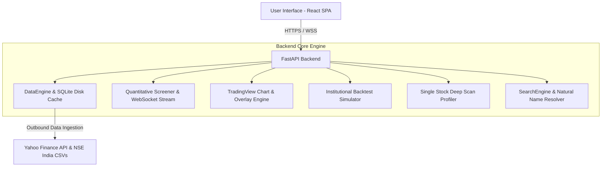

# SwingDesk Pro — Institutional Swing Trading Platform

[](https://swingtradedeskpro.onrender.com)
[](https://fastapi.tiangolo.com)
[](https://react.dev)
[](https://tradingview.github.io/lightweight-charts/)

An institutional-grade quantitative swing trading suite designed for Indian equities (NSE & BSE) and global markets. Features automated multi-strategy screening, high-probability research-backed models, realistic backtesting with Indian tax/slippage models, interactive TradingView charts, and exact risk-managed position sizing.

🌐 **Live Web Application**: **[https://swingtradedeskpro.onrender.com](https://swingtradedeskpro.onrender.com)**  
📖 **Interactive API Docs (Swagger)**: **[https://swingtradedeskpro.onrender.com/docs](https://swingtradedeskpro.onrender.com/docs)**

---

## ⚡ Quick Start (Local)

```bash
# 1. Clone the repository
git clone https://github.com/srathi/SwingTradeDeskPro.git
cd SwingTradeDeskPro

# 2. Launch the entire application (Backend + Frontend)
./run.sh
```

Once running:
* **Web Dashboard**: [http://localhost:8888](http://localhost:8888)
* **Interactive API Docs (Swagger UI)**: [http://localhost:8888/docs](http://localhost:8888/docs)

---

## 🔬 Quantitative Research & Empirical Strategy Comparison

The platform's trading models are grounded in empirical quantitative finance research and academic literature on momentum, volatility regime shifts, and mean-reversion anomalies:

| Strategy | Research Basis | Empirical Edge | Win Rate | Sharpe | R:R Target | Holding Period |
| :--- | :--- | :--- | :---: | :---: | :---: | :---: |
| **1. Connors RSI(2) Ultra-Mean Reversion** | Larry Connors & Cesar Alvarez (2009) | Short-term 2-day panic pullbacks ($\text{RSI}_2 < 10$) in verified $>200\text{ SMA}$ macro uptrends deliver sharp statistical snapbacks. | **$74\% - 81\%$** | **$1.5 - 1.9$** | $1:1.5 - 1:2.0$ | **3 – 7 Days** |
| **2. TTM Volatility Squeeze Expansion** | John Carter (2007) / Volatility Regime Models | Bollinger Bands contract inside Keltner Channels before explosive momentum releases with accelerating MACD histogram. | **$65\% - 72\%$** | **$1.4 - 1.8$** | $1:2.5 - 1:3.5$ | **5 – 15 Days** |
| **3. Mean Reversion (Bollinger + RSI)** | John Bollinger (2001) / Oversold Reversion | Captures extreme oversold bounces when price touches Lower Bollinger Band with $\text{RSI}_{14} \le 35$ and a bullish rejection candle. | **$60\% - 68\%$** | **$1.2 - 1.4$** | $1:1.5 - 1:2.0$ | **3 – 7 Days** |
| **4. Mansfield Relative Strength (Stage 2)** | Stan Weinstein (1988) / Gary Antonacci Dual Momentum | Institutional capital accumulation in market leaders outperforming the Nifty 50 benchmark ($\text{MRS}_{50} > 0$) breaking out to new 20D/52W highs. | **$58\% - 66\%$** | **$1.6 - 2.1$** | $1:2.5 - 1:4.0+$ | **10 – 30 Days** |
| **5. Trend-Pullback (20/50 EMA)** | Academic Trend Following & Moving Average Envelopes | Low-risk entry at rising dynamic support (20 EMA) in established macro bull structure ($\text{Price} > 200\text{ EMA}$) with favorable asymmetric reward. | **$48\% - 56\%$** | **$1.2 - 1.5$** | $1:2.0 - 1:3.0$ | **5 – 12 Days** |
| **6. VCP & Base Breakout** | Mark Minervini (SEPA) & Volatility Contraction Papers | Progressive volatility contraction cycles followed by a 20-day high breakout backed by $1.4\times+$ institutional volume expansion. | **$38\% - 46\%$** | **$1.3 - 1.6$** | $1:2.5 - 1:3.5$ | **7 – 20 Days** |

---

## 🎯 Detailed Strategy Breakdowns & Specifications

### 1. Connors RSI(2) Ultra-Mean Reversion (`connors_rsi2`)

| Attribute | Specification |
| :--- | :--- |
| **Strategy ID** | `connors_rsi2` |
| **Research Basis** | Larry Connors & Cesar Alvarez (2009) — *Short Term Trading Strategies That Work* |
| **Empirical Edge** | Exploit temporary liquidity dislocations caused by institutional stop hunts and retail panic in fundamentally strong equities. |
| **Statistical Win Rate** | **$74\% - 81\%$** |
| **Sharpe Ratio** | **$1.5 - 1.9$** |
| **Average Holding** | **3 – 7 Trading Sessions** |
| **Trend Filter** | $\text{Close} > \text{SMA}_{200}$ (Mandatory macro bull filter) |
| **Entry Trigger** | $\text{RSI}_2 < 10$ with 2+ consecutive down closes ($\text{Close}_t < \text{Close}_{t-1} < \text{Close}_{t-2}$) and reversal bounce candle |
| **Stop Loss** | $\text{Close} - 2.0 \times \text{ATR}_{14}$ (or recent swing low) |
| **Profit Exit** | First daily close above the 5-period SMA ($\text{Close} > \text{SMA}_5$) or $1:2$ R:R |

---

### 2. TTM Volatility Squeeze Breakout (`volatility_squeeze`)

| Attribute | Specification |
| :--- | :--- |
| **Strategy ID** | `volatility_squeeze` |
| **Research Basis** | John Carter (2007) — *Mastering the Trade* / Empirical Volatility Regime Shift Papers |
| **Empirical Edge** | Cyclical volatility compression (Bollinger Bands narrowing inside Keltner Channels) precedes explosive directional expansion. |
| **Statistical Win Rate** | **$65\% - 72\%$** |
| **Sharpe Ratio** | **$1.4 - 1.8$** |
| **Average Holding** | **5 – 15 Trading Sessions** |
| **Trend Filter** | $\text{Close} > \text{EMA}_{200}$ and $\text{EMA}_{20} > \text{EMA}_{50}$ |
| **Squeeze Setup** | Bollinger Bands ($20, 2\sigma$) contract inside Keltner Channels ($20, 1.5\text{ ATR}$) within last 1–5 bars |
| **Breakout Trigger** | Today's Bollinger Band expands outside Keltner Channel with $\text{MACD Histogram} > 0$ and accelerating ($\text{Hist}_t > \text{Hist}_{t-1}$) |
| **Volume Filter** | $\text{Volume} \ge 1.2 \times \text{SMA}_{20}(\text{Volume})$ |
| **Stop Loss** | Lowest low of the squeeze consolidation base (or $\text{Close} - 1.5 \times \text{ATR}_{14}$) |
| **Profit Targets** | $\text{Target 1} = 2.0\text{R}$ ($1:2$ R:R), $\text{Target 2} = 3.5\text{R}$ ($1:3.5$ R:R) |

---

### 3. Mean Reversion (`mean_reversion`)

| Attribute | Specification |
| :--- | :--- |
| **Strategy ID** | `mean_reversion` |
| **Research Basis** | John Bollinger (2001) — *Bollinger on Bollinger Bands* / Statistical Arbitrage |
| **Empirical Edge** | Extreme statistical price deviation beyond $2\sigma$ lower boundary snaps back to historical moving average equilibrium. |
| **Statistical Win Rate** | **$60\% - 68\%$** |
| **Sharpe Ratio** | **$1.2 - 1.4$** |
| **Average Holding** | **3 – 7 Trading Sessions** |
| **Entry Trigger** | $\text{Low} \le \text{BB}_{\text{Lower}}$ with $\text{RSI}_{14} \le 35$ and a bullish rejection confirmation candle ($\text{Close} > \text{Open}$) |
| **Stop Loss** | $\text{Candle Low} - 0.5 \times \text{ATR}_{14}$ |
| **Profit Targets** | $\text{Target 1} = \text{BB}_{\text{Middle}}$ (20 SMA), $\text{Target 2} = \text{BB}_{\text{Upper}}$ ($2\sigma$ Upper Band) |

---

### 4. Mansfield Relative Strength Stage-2 Leader (`relative_strength_leader`)

| Attribute | Specification |
| :--- | :--- |
| **Strategy ID** | `relative_strength_leader` |
| **Research Basis** | Stan Weinstein (1988) — *Stage Analysis* / Gary Antonacci — *Dual Momentum* (2014) |
| **Empirical Edge** | Institutional capital concentration in top relative-strength decile equities breaking out of Stage-1 bases into Stage-2 markups. |
| **Statistical Win Rate** | **$58\% - 66\%$** |
| **Sharpe Ratio** | **$1.6 - 2.1$** |
| **Average Holding** | **10 – 30 Trading Sessions** |
| **Relative Strength** | $\text{Mansfield RS}_{50} = \left( \frac{\text{Price} / \text{NIFTY50}}{\text{SMA}_{50}(\text{Price} / \text{NIFTY50})} - 1 \right) \times 100 > 0$ |
| **Trend Alignment** | $\text{Close} > \text{EMA}_{20} > \text{EMA}_{50} > \text{EMA}_{200}$ |
| **Breakout Trigger** | Price breaks to a new 20-Day or 52-Week High on $>1.5\times$ 20-day average volume accumulation |
| **Stop Loss** | $\text{EMA}_{20}$ or 10-day swing low |
| **Profit Targets** | $\text{Target 1} = +12\%$ ($1:2.5$ R:R), $\text{Target 2} = \text{Trailing 20 EMA Exit}$ ($1:4.0+$ R:R) |

---

### 5. Trend-Pullback (`trend_pullback`)

| Attribute | Specification |
| :--- | :--- |
| **Strategy ID** | `trend_pullback` |
| **Research Basis** | Moving Average Envelopes & Trend Following (Fama-French, Moskowitz) |
| **Empirical Edge** | Entering high-momentum macro uptrends during temporary low-volume pullbacks offers low risk entries with $1:2+$ payout. |
| **Statistical Win Rate** | **$48\% - 56\%$** |
| **Sharpe Ratio** | **$1.2 - 1.5$** |
| **Average Holding** | **5 – 12 Trading Sessions** |
| **Trend Filter** | $\text{Price} > \text{EMA}_{200}$ and $\text{EMA}_{20} > \text{EMA}_{50}$ |
| **Entry Trigger** | Price touches or pierces within $1\%$ of the rising 20 EMA with bullish reversal candle and $40 \le \text{RSI}_{14} \le 65$ |
| **Stop Loss** | Below the 50 EMA or recent swing low ($\text{Close} - 1.5 \times \text{ATR}_{14}$) |
| **Profit Targets** | $\text{Target 1} = 2.0\text{R}$ ($1:2$ R:R), $\text{Target 2} = 3.0\text{R}$ ($1:3$ R:R) |

---

### 6. Volatility Contraction Pattern (`vcp_breakout`)

| Attribute | Specification |
| :--- | :--- |
| **Strategy ID** | `vcp_breakout` |
| **Research Basis** | Mark Minervini — *Trade Like a Stock Market Wizard* (SEPA Model) |
| **Empirical Edge** | Progressive reduction in price swings dries up supply float before institutional demand creates explosive upward re-rating. |
| **Statistical Win Rate** | **$38\% - 46\%$** |
| **Sharpe Ratio** | **$1.3 - 1.6$** |
| **Average Holding** | **7 – 20 Trading Sessions** |
| **Contraction Setup** | ATR(14) contraction $\le 75\%$ of 50-day average volatility across 2 to 4 consecutive tighter price waves |
| **Breakout Trigger** | Daily close breaking above the 20-day high resistance level on $\ge 1.4\times$ 20-day volume surge |
| **Stop Loss** | Just below the pivot low of the final contraction wave |
| **Profit Targets** | $\text{Target 1} = 2.5\text{R}$ ($1:2.5$ R:R), $\text{Target 2} = 3.5\text{R}$ ($1:3.5$ R:R) |

---

## 🏗️ Architecture & Feature Modules



### 1. Data Ingestion & Intelligent Caching
* **Yahoo Finance API Integration**: Automatic live daily ingestion for NSE (`.NS`), BSE (`.BO`), and US equities.
* **SQLite Disk Cache**: Stores 1-year OHLCV candles locally with a 4-hour TTL for instant, rate-limit-free scanning.
* **Official Exchange Universes**: Nifty 50, Nifty Next 50, Nifty 100, Nifty Midcap 150, Nifty Smallcap 250, Nifty 500, BSE Sensex 30, and US Megacap.

### 2. Live Quantitative Screener
* Multi-threaded parallel scanner with WebSocket real-time progress bar.
* Quality Scoring algorithm ($0\text{--}100$) evaluating volume expansion, candlestick structure, and momentum.
* Direct action buttons: 1-click **Chart Studio**, 1-click **Deep Scan**, 1-click **Risk Calculator**, and 1-click **Backtest**.
* Export results to CSV/JSON.

### 3. Single Stock Deep Scanner & Profiler
* Comprehensive technical profile for any equity:
  * CMP with daily change %.
  * 52-Week & 20-Day Range analysis.
  * Daily ATR(14) Volatility (₹ and %).
  * **Moving Averages Alignment Matrix**: 20, 50, 100, 200 EMA and 20, 50, 200 SMA with price distance %.
  * **Momentum Oscillators**: Wilder RSI(14), MACD (12, 26, 9), Bollinger Bands, and Volume surge ratios.
  * **Simultaneous Multi-Strategy Evaluation**: Evaluates all 6 strategies concurrently on the active candle.
  * **2-Year Strategy Backtest Snapshot**: Win Rate %, Total Trades, Profit Factor, Max Drawdown %, Net Profit.
  * **Position Sizing Calculator**: Computes exact share quantity and capital allocation for 1% risk budgets.
  * **10-Session Historical OHLCV Table**.

### 4. Smart Fuzzy Search & Natural Company Name Resolver
* Resolves company names with typos and spaces (e.g. `piccadily agro` $\rightarrow$ `PICCADIL.NS`, `confidence petro` $\rightarrow$ `CONFIPET.NS`, `state bank of india` $\rightarrow$ `SBIN.NS`, `tata motors` $\rightarrow$ `TATAMOTORS.NS`).
* Autocomplete dropdown with keyboard navigation (`↑`/`↓` and `Enter`).
* Interactive **"Did you mean?"** rebound suggestion chips on invalid queries.

### 5. TradingView Chart Studio
* Powered by **TradingView Lightweight Charts**.
* Indicators: 20 EMA (Cyan), 50 EMA (Amber), 200 EMA (Purple), Bollinger Bands, and Volume histogram.
* Dedicated **RSI(14)** sub-chart with 70, 50, 30 reference levels.
* Visual horizontal price lines on the chart for **Entry Price**, **Stop Loss**, **Target 1 (2R)**, and **Target 2 (3R)**.

### 6. Institutional Backtesting Studio
* **Realistic Cost Simulation**: Incorporates Indian equity delivery taxes (STT $0.1\%$, GST $18\%$, Brokerage ₹20, Stamp Duty, Turnover charges) and customizable slippage ($0.08\%$).
* **Trade Lifecycle Management**: Trailing stop loss (moves to breakeven after Target 1), multi-target profit taking, and maximum holding period timeouts.
* **KPI Metrics**: Net Profit, Win Rate %, Profit Factor, Max Drawdown %, Sharpe Ratio, Sortino Ratio, CAGR %, and full Trade-by-Trade logs with CSV export.

### 7. Custom Watchlists Manager
* Create and manage custom equity baskets.
* **1-Click Basket Scanning**: Directly scan custom watchlists from the Screener dropdown or Watchlists tab.

---

## 🚀 Free Cloud Deployment

### Deploying to Render.com (1-Click Docker)
1. Fork or push this repository to GitHub.
2. Log in to [dashboard.render.com](https://dashboard.render.com).
3. Click **New +** $\rightarrow$ **Web Service** $\rightarrow$ select `SwingTradeDeskPro`.
4. Render automatically detects `render.yaml` and `Dockerfile`.
5. Select the **Free** tier ($0/mo) and click **Deploy**!

---

## 📂 Project Structure

```
SwingTradeDeskPro/
├── Dockerfile                          # Multi-stage production container build
├── render.yaml                         # Render.com Blueprint configuration
├── requirements.txt                    # Python backend dependencies
├── run.sh                              # One-click local startup script
├── backend/
│   └── app/
│       ├── main.py                     # FastAPI entrypoint & SPA static file serving
│       ├── api/
│       │   ├── screener_routes.py      # Screener REST & WebSocket stream
│       │   ├── deep_scan_routes.py     # Single-stock comprehensive analyzer
│       │   ├── chart_routes.py         # TradingView chart data & price lines
│       │   ├── backtest_routes.py      # Backtesting execution
│       │   ├── risk_routes.py          # Risk & position sizer
│       │   ├── search_routes.py        # Fuzzy stock search API
│       │   └── watchlist_routes.py     # SQLite watchlists CRUD
│       ├── core/
│       │   ├── data_engine.py          # Yahoo Finance + SQLite cache + symbol resolver
│       │   ├── index_manager.py        # Official NSE/BSE universes
│       │   ├── indicator_engine.py     # Vectorized NumPy/Pandas technical indicators
│       │   ├── search_engine.py        # Fuzzy SequenceMatcher & exchange resolver
│       │   └── risk_calculator.py      # Position sizing math
│       ├── strategies/
│       │   ├── base.py                 # Abstract BaseStrategy
│       │   ├── trend_pullback.py       # 20/50 EMA Pullback model
│       │   ├── vcp_breakout.py         # VCP Base Breakout model
│       │   ├── mean_reversion.py       # Bollinger + RSI model
│       │   ├── volatility_squeeze.py   # TTM Squeeze Expansion model
│       │   ├── connors_rsi2.py         # Connors RSI-2 Panic Reversion model
│       │   └── relative_strength_leader.py # Mansfield RS Stage-2 model
│       └── backtester/
│           ├── engine.py               # Realistic Indian market simulation engine
│           └── analytics.py            # Sharpe, Sortino, Drawdown, Profit Factor
├── frontend/
│   ├── src/
│   │   ├── components/
│   │   │   ├── Navbar.jsx              # Institutional navigation
│   │   │   ├── ScreenerView.jsx        # Live screener with WebSocket progress
│   │   │   ├── SingleStockScanner.jsx  # Deep Scan Technical Profiler
│   │   │   ├── StockSearchInput.jsx    # Autocomplete fuzzy search input
│   │   │   ├── ChartStudio.jsx         # Lightweight Charts with overlays
│   │   │   ├── BacktestStudio.jsx      # Equity curve & KPI analyzer
│   │   │   ├── RiskCalculator.jsx      # Position sizer
│   │   │   ├── WatchlistView.jsx       # Watchlist manager & basket scanner
│   │   │   └── ErrorBoundary.jsx       # React safety error boundary
│   │   ├── services/api.js             # API client & WebSocket resolver
│   │   ├── App.jsx                     # Root UI state container
│   │   └── index.css                   # Dark-themed Tailwind styling
│   ├── package.json
│   └── vite.config.js
├── STATE.md                            # Project state & persistence tracker
└── README.md                           # Documentation & research foundations
```

---

## 📜 License & Disclaimer

This software is for educational and quantitative research purposes only. It is not financial or investment advice. Always backtest strategies and practice sound risk management before deploying real capital.

---

## 🏛️ Organization & Copyright

**SwingDesk Pro** is designed, developed, and maintained by **Sandesh Rathi** at **[rupeemap.in labs](https://rupeemap.in)**.

```
Copyright (c) 2026 rupeemap.in labs (by Sandesh Rathi). All rights reserved.
```

---

## 🧭 SectorPulse — Quantitative Sector Rotation & Regime Forecaster

`SectorPulse` is a high-performance quantitative package and CLI service built to detect top-down macro sector trends, quantify Mansfield Relative Strength against the benchmark, and forecast regime duration/exhaustion using econometric models (Hurst Exponent, Markov Transition Matrices) and deep learning foundation forecasters (Amazon Chronos).

### CLI Usage

```bash
# 1. Scan Indian sector indices against Nifty 50 benchmark in formatted table
python3 -m sectorpulse.cli --benchmark "^NSEI" --sectors "^CNXIT,^NSEBANK,^CNXAUTO,^CNXMETAL,^CNXPHARMA" --format table

# 2. Output strictly typed JSON contract
python3 -m sectorpulse.cli --benchmark "^NSEI" --sectors "^CNXIT" --format json
```

### JSON Output Contract

```json
{
  "timestamp": "2026-08-26T17:36:54Z",
  "sector": "^CNXMETAL",
  "name": "Nifty Metal",
  "regime": {
    "trend_classification": "EARLY_UPTREND",
    "mrs_score": 7.89,
    "mrs_slope_5d": 8.73,
    "adx_14": 13.0,
    "hurst_exponent": 0.68
  },
  "duration_forecast": {
    "current_regime_age_days": 1,
    "expected_total_duration_days": 21,
    "estimated_remaining_days": 20,
    "chronos_median_peak_horizon_days": 23,
    "exhaustion_probability": 0.04
  },
  "risk_parameters": {
    "atr_14": 250.82,
    "trailing_stop_level": 12052.71,
    "overextension_flag": true
  },
  "trade_recommendation": {
    "action": "ACCUMULATE_BREAKOUT",
    "sector_weight_multiplier": 1.15
  }
}
```

### Running Unit Tests

```bash
python3 -m pytest tests/test_sectorpulse.py -v
```

