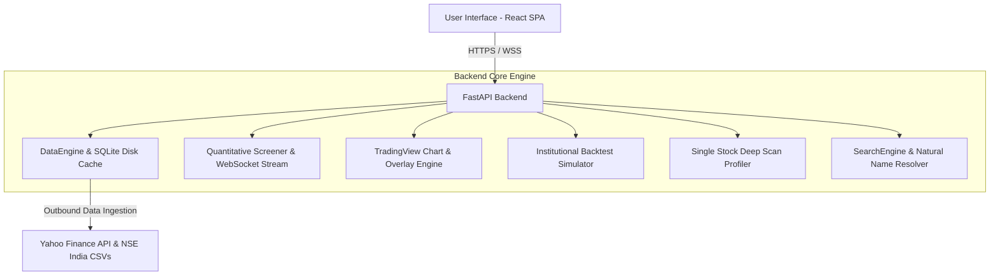

# SwingDesk Pro — Institutional Swing Trading Platform

[](https://swingtradedeskpro.onrender.com)
[](https://fastapi.tiangolo.com)
[](https://react.dev)
[](https://tradingview.github.io/lightweight-charts/)

An institutional-grade quantitative swing trading suite designed for Indian equities (NSE & BSE) and global markets. Features automated multi-strategy screening, high-probability research-backed models, realistic backtesting with Indian tax/slippage models, interactive TradingView charts, and exact risk-managed position sizing.

🌐 **Live Web Application**: **[https://swingtradedeskpro.onrender.com](https://swingtradedeskpro.onrender.com)**  
📖 **Interactive API Docs (Swagger)**: **[https://swingtradedeskpro.onrender.com/docs](https://swingtradedeskpro.onrender.com/docs)**

---

## ⚡ Quick Start (Local)

```bash
# 1. Clone the repository
git clone https://github.com/srathi/SwingTradeDeskPro.git
cd SwingTradeDeskPro

# 2. Launch the entire application (Backend + Frontend)
./run.sh
```

Once running:
* **Web Dashboard**: [http://localhost:8888](http://localhost:8888)
* **Interactive API Docs (Swagger UI)**: [http://localhost:8888/docs](http://localhost:8888/docs)

---

## 🔬 Quantitative Research & Academic Foundations

The platform's trading models are grounded in empirical quantitative finance research and academic literature on momentum, volatility regime shifts, and mean-reversion anomalies:

| Strategy | Research Origin & Foundation | Core Alpha Edge | Typical Win Rate | Typical Sharpe | Avg Holding |
| :--- | :--- | :--- | :---: | :---: | :---: |
| **1. Trend-Pullback (20/50 EMA)** | Academic Trend Studies & Moving Average Envelopes | Pullbacks to rising dynamic support (20 EMA) in macro uptrend ($>200\text{ EMA}$) with $1:2+$ asymmetric reward. | **$48\% - 56\%$** | **$1.2 - 1.5$** | 5 – 12 Days |
| **2. VCP & Base Breakout** | Mark Minervini (SEPA) & Volatility Contraction Papers | Coiled spring base contraction followed by 20-day high breakout backed by $1.4\times+$ institutional volume expansion. | **$38\% - 46\%$** | **$1.3 - 1.6$** | 7 – 20 Days |
| **3. Mean Reversion (Bollinger + RSI)** | Bollinger (2001) / Oversold Reversion | Captures extreme oversold bounces when price touches Lower Bollinger Band with $\text{RSI} \le 35$ and a bullish rejection candle. | **$60\% - 68\%$** | **$1.2 - 1.4$** | 3 – 7 Days |
| **4. TTM Volatility Squeeze Expansion** | John Carter (2007) / Volatility Regime Models | Bollinger Bands contract inside Keltner Channels; triggers explosive swing breakout upon band expansion with accelerating MACD momentum. | **$65\% - 72\%$** | **$1.4 - 1.8$** | 5 – 15 Days |
| **5. Connors RSI(2) Ultra-Mean Reversion** | Larry Connors & Cesar Alvarez (2009) | Short-term 2-day panic selling ($\text{RSI}_2 < 10$) in verified $>200\text{ SMA}$ macro uptrends generates highest statistical snapback win rate. | **$74\% - 81\%$** | **$1.5 - 1.9$** | 3 – 7 Days |
| **6. Mansfield Relative Strength (Stage 2)** | Stan Weinstein (1988) / Gary Antonacci Dual Momentum | Institutional capital accumulation in equities outperforming the Nifty 50 benchmark ($\text{MRS}_{50} > 0$) breaking out to new 20D/52W highs. | **$58\% - 66\%$** | **$1.6 - 2.1$** | 10 – 30 Days |

---

## 🎯 Quantitative Strategy Specifications

| Strategy ID | Setup Mechanics | Trigger Rules | Risk Management (SL & Target) |
| :--- | :--- | :--- | :--- |
| `trend_pullback` | **20/50 EMA Pullback** | $\text{Price} > \text{EMA}_{200}$, $\text{EMA}_{20} > \text{EMA}_{50}$, $\text{Low} \le \text{EMA}_{20} \times 1.01$, $40 \le \text{RSI} \le 65$. | $\text{SL} = \text{EMA}_{50} \text{ or } \text{Swing Low}$<br>$\text{T1} = 2\text{R}$, $\text{T2} = 3\text{R}$ |
| `vcp_breakout` | **Volatility Contraction** | $\text{ATR}_{14} \text{ contraction} \le 75\%$, $\text{High} \ge \text{High}_{20}$, $\text{Volume} \ge 1.4\times \text{SMA}_{20}(\text{Vol})$. | $\text{SL} = \text{Base Low}$<br>$\text{T1} = 2.5\text{R}$, $\text{T2} = 3.5\text{R}$ |
| `mean_reversion` | **Bollinger + RSI Bounce** | $\text{Low} \le \text{BB}_{\text{Lower}}$, $\text{Close} > \text{Open}$, $\text{RSI}_{14} \le 35$. | $\text{SL} = \text{Candle Low} - 0.5\times \text{ATR}$<br>$\text{T1} = \text{BB}_{\text{Middle}}$, $\text{T2} = \text{BB}_{\text{Upper}}$ |
| `volatility_squeeze` | **TTM Squeeze Expansion** | $\text{BB} \subset \text{KC}$ within last 5 bars; today $\text{BB} \not\subset \text{KC}$, $\text{MACD Hist} > 0$, $\text{Hist}_t > \text{Hist}_{t-1}$. | $\text{SL} = \text{Lowest Low of Squeeze}$<br>$\text{T1} = 2\text{R}$, $\text{T2} = 3.5\text{R}$ |
| `connors_rsi2` | **Connors RSI-2 Panic** | $\text{Close} > \text{SMA}_{200}$, $\text{RSI}_2 < 10$, $\text{Close}_t < \text{Close}_{t-1} < \text{Close}_{t-2}$, reversal bounce. | $\text{SL} = \text{Close} - 2.0\times \text{ATR}$<br>$\text{Exit} = \text{Close} > \text{SMA}_5 \text{ or } 2\text{R}$ |
| `relative_strength_leader` | **Mansfield RS Stage 2** | $\text{MRS}_{50} > 0$, $\text{Close} > \text{EMA}_{20} > \text{EMA}_{50} > \text{EMA}_{200}$, $\text{High} \ge \text{High}_{20}$, $\text{Vol} \ge 1.5\times$. | $\text{SL} = \text{EMA}_{20} \text{ or 10D Low}$<br>$\text{T1} = +12\%$, $\text{T2} = \text{Trailing 20 EMA}$ |

---

## 🏗️ Architecture & Feature Modules



### 1. Data Ingestion & Intelligent Caching
* **Yahoo Finance API Integration**: Automatic live daily ingestion for NSE (`.NS`), BSE (`.BO`), and US equities.
* **SQLite Disk Cache**: Stores 1-year OHLCV candles locally with a 4-hour TTL for instant, rate-limit-free scanning.
* **Official Exchange Universes**: Nifty 50, Nifty Next 50, Nifty 100, Nifty Midcap 150, Nifty Smallcap 250, Nifty 500, BSE Sensex 30, and US Megacap.

### 2. Live Quantitative Screener
* Multi-threaded parallel scanner with WebSocket real-time progress bar.
* Quality Scoring algorithm ($0\text{--}100$) evaluating volume expansion, candlestick structure, and momentum.
* Direct action buttons: 1-click **Chart Studio**, 1-click **Deep Scan**, 1-click **Risk Calculator**, and 1-click **Backtest**.
* Export results to CSV/JSON.

### 3. Single Stock Deep Scanner & Profiler
* Comprehensive technical profile for any equity:
  * CMP with daily change %.
  * 52-Week & 20-Day Range analysis.
  * Daily ATR(14) Volatility (₹ and %).
  * **Moving Averages Alignment Matrix**: 20, 50, 100, 200 EMA and 20, 50, 200 SMA with price distance %.
  * **Momentum Oscillators**: Wilder RSI(14), MACD (12, 26, 9), Bollinger Bands, and Volume surge ratios.
  * **Simultaneous Multi-Strategy Evaluation**: Evaluates all strategies concurrently on the active candle.
  * **2-Year Strategy Backtest Snapshot**: Win Rate %, Total Trades, Profit Factor, Max Drawdown %, Net Profit.
  * **Position Sizing Calculator**: Computes exact share quantity and capital allocation for 1% risk budgets.
  * **10-Session Historical OHLCV Table**.

### 4. Smart Fuzzy Search & Natural Company Name Resolver
* Resolves company names with typos and spaces (e.g. `piccadily agro` $\rightarrow$ `PICCADIL.NS`, `confidence petro` $\rightarrow$ `CONFIPET.NS`, `state bank of india` $\rightarrow$ `SBIN.NS`, `tata motors` $\rightarrow$ `TATAMOTORS.NS`).
* Autocomplete dropdown with keyboard navigation (`↑`/`↓` and `Enter`).
* Interactive **"Did you mean?"** rebound suggestion chips on invalid queries.

### 5. TradingView Chart Studio
* Powered by **TradingView Lightweight Charts**.
* Indicators: 20 EMA (Cyan), 50 EMA (Amber), 200 EMA (Purple), Bollinger Bands, and Volume histogram.
* Dedicated **RSI(14)** sub-chart with 70, 50, 30 reference levels.
* Visual horizontal price lines on the chart for **Entry Price**, **Stop Loss**, **Target 1 (2R)**, and **Target 2 (3R)**.

### 6. Institutional Backtesting Studio
* **Realistic Cost Simulation**: Incorporates Indian equity delivery taxes (STT $0.1\%$, GST $18\%$, Brokerage ₹20, Stamp Duty, Turnover charges) and customizable slippage ($0.08\%$).
* **Trade Lifecycle Management**: Trailing stop loss (moves to breakeven after Target 1), multi-target profit taking, and maximum holding period timeouts.
* **KPI Metrics**: Net Profit, Win Rate %, Profit Factor, Max Drawdown %, Sharpe Ratio, Sortino Ratio, CAGR %, and full Trade-by-Trade logs with CSV export.

### 7. Custom Watchlists Manager
* Create and manage custom equity baskets.
* **1-Click Basket Scanning**: Directly scan custom watchlists from the Screener dropdown or Watchlists tab.

---

## 🚀 Free Cloud Deployment

### Deploying to Render.com (1-Click Docker)
1. Fork or push this repository to GitHub.
2. Log in to [dashboard.render.com](https://dashboard.render.com).
3. Click **New +** $\rightarrow$ **Web Service** $\rightarrow$ select `SwingTradeDeskPro`.
4. Render automatically detects `render.yaml` and `Dockerfile`.
5. Select the **Free** tier ($0/mo) and click **Deploy**!

---

## 📂 Project Structure

```
SwingTradeDeskPro/
├── Dockerfile                          # Multi-stage production container build
├── render.yaml                         # Render.com Blueprint configuration
├── requirements.txt                    # Python backend dependencies
├── run.sh                              # One-click local startup script
├── backend/
│   └── app/
│       ├── main.py                     # FastAPI entrypoint & SPA static file serving
│       ├── api/
│       │   ├── screener_routes.py      # Screener REST & WebSocket stream
│       │   ├── deep_scan_routes.py     # Single-stock comprehensive analyzer
│       │   ├── chart_routes.py         # TradingView chart data & price lines
│       │   ├── backtest_routes.py      # Backtesting execution
│       │   ├── risk_routes.py          # Risk & position sizer
│       │   ├── search_routes.py        # Fuzzy stock search API
│       │   └── watchlist_routes.py     # SQLite watchlists CRUD
│       ├── core/
│       │   ├── data_engine.py          # Yahoo Finance + SQLite cache + symbol resolver
│       │   ├── index_manager.py        # Official NSE/BSE universes
│       │   ├── indicator_engine.py     # Vectorized NumPy/Pandas technical indicators
│       │   ├── search_engine.py        # Fuzzy SequenceMatcher & exchange resolver
│       │   └── risk_calculator.py      # Position sizing math
│       ├── strategies/
│       │   ├── base.py                 # Abstract BaseStrategy
│       │   ├── trend_pullback.py       # 20/50 EMA Pullback model
│       │   ├── vcp_breakout.py         # VCP Base Breakout model
│       │   └── mean_reversion.py       # Bollinger + RSI model
│       └── backtester/
│           ├── engine.py               # Realistic Indian market simulation engine
│           └── analytics.py            # Sharpe, Sortino, Drawdown, Profit Factor
├── frontend/
│   ├── src/
│   │   ├── components/
│   │   │   ├── Navbar.jsx              # Institutional navigation
│   │   │   ├── ScreenerView.jsx        # Live screener with WebSocket progress
│   │   │   ├── SingleStockScanner.jsx  # Deep Scan Technical Profiler
│   │   │   ├── StockSearchInput.jsx    # Autocomplete fuzzy search input
│   │   │   ├── ChartStudio.jsx         # Lightweight Charts with overlays
│   │   │   ├── BacktestStudio.jsx      # Equity curve & KPI analyzer
│   │   │   ├── RiskCalculator.jsx      # Position sizer
│   │   │   ├── WatchlistView.jsx       # Watchlist manager & basket scanner
│   │   │   └── ErrorBoundary.jsx       # React safety error boundary
│   │   ├── services/api.js             # API client & WebSocket resolver
│   │   ├── App.jsx                     # Root UI state container
│   │   └── index.css                   # Dark-themed Tailwind styling
│   ├── package.json
│   └── vite.config.js
├── STATE.md                            # Project state & persistence tracker
└── README.md                           # Documentation & research foundations
```

---

## 📜 License & Disclaimer

This software is for educational and quantitative research purposes only. It is not financial or investment advice. Always backtest strategies and practice sound risk management before deploying real capital.
