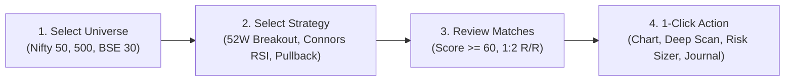
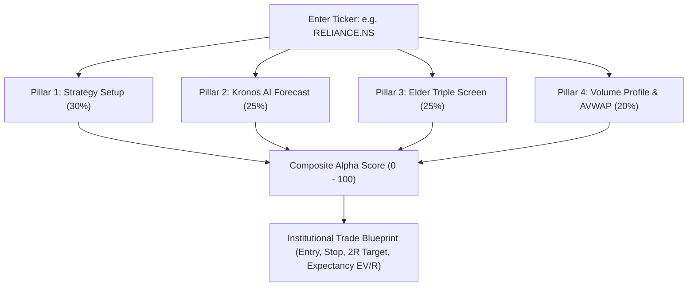
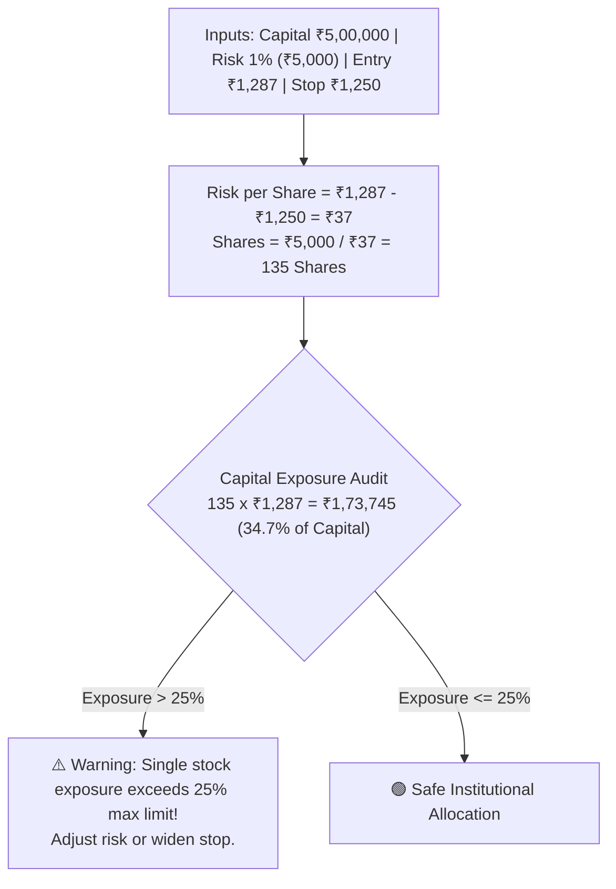
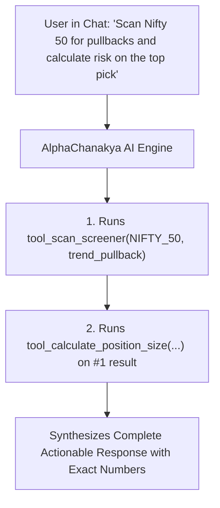

# SwingTradeDesk Pro — End-User Master Guide

Welcome to **SwingTradeDesk Pro**, an institutional-grade quantitative swing trading and market intelligence platform designed for Indian Equities (NSE/BSE) and global markets by [rupeemap.in labs](https://www.rupeemap.in) (by Sandesh Rathi).

This comprehensive guide is written from the **trader's perspective** to walk you through every module, quantitative tool, and AI capability step-by-step.

---

## 📑 Table of Contents

1. [Platform Overview & Core Philosophy](#1-platform-overview--core-philosophy)
2. [Macro Market Regime & Market Breadth Bar](#2-macro-market-regime--market-breadth-bar)
3. [Live Quantitative Screener](#3-live-quantitative-screener)
4. [360° Stock Deep Scan & Alpha Fusion Studio](#4-360-stock-deep-scan--alpha-fusion-studio)
5. [Sector Pulse & Constituent Leaderboards](#5-sector-pulse--constituent-leaderboards)
6. [Kronos AI Foundation Candlestick Forecaster](#6-kronos-ai-foundation-candlestick-forecaster)
7. [TradingView Chart Studio](#7-tradingview-chart-studio)
8. [Walk-Forward Backtest Studio](#8-walk-forward-backtest-studio)
9. [Institutional Risk & Position Sizing Calculator](#9-institutional-risk--position-sizing-calculator)
10. [Paper Trading Journal & Analytics](#10-paper-trading-journal--analytics)
11. [AlphaChanakya AI Copilot (Autonomous Quant Assistant)](#11-alphachanakya-ai-copilot-autonomous-quant-assistant)
12. [Keyboard Shortcuts & In-App Guide](#12-keyboard-shortcuts--in-app-guide)

---

## 1. Platform Overview & Core Philosophy

SwingTradeDesk Pro is built on **4 Cardinal Rules of Institutional Quantitative Swing Trading**:

1. **Trade with Macro & Sector Tailwinds**: Only buy breakout and momentum stocks when the macro market and sector are in a verified Stage 2 uptrend with healthy market breadth.
2. **Never Risk More Than 1% Per Trade**: Your account capital is your lifeblood. Size every trade so that hitting your stop loss loses $\le 1.0\%$ of your total portfolio.
3. **Demand Asymmetric Risk/Reward ($\ge 1:2$)**: Only execute trade setups where the mathematical profit target is at least $2\times$ your stop loss distance ($2\text{R}$).
4. **Multi-Pillar Confirmation (Alpha Fusion)**: Eliminate single-indicator false signals by synthesizing price action, Volume Profile (POC/VAH/VAL), Elder Triple Screen, and AI neural forecasting.

---

## 2. Macro Market Regime & Market Breadth Bar

Located at the very top of your screen, the **Macro Header** acts as your market traffic light before placing any trades.

### Key Metrics & How to Interpret Them:

* **Benchmark Ticker & CMP**: Shows live price and % change for **NIFTY 50** (`^NSEI`), **BSE SENSEX** (`^BSESN`), and **INDIA VIX** (`^INDIAVIX`). Click any index chip to open its full diagnostic drawer.
* **Market Breadth (% Above 200 EMA & 50 EMA)**:
  * 🟢 **$> 60\%$ Above 200 EMA (`BULLISH EXPANSION`)**: Broad-based institutional accumulation. Green light for aggressive breakout strategies.
  * 🟡 **$40\% - 60\%$ Above 200 EMA (`SELECTIVE MIXED`)**: Selective market. Focus strictly on top-ranked sector leaders and high Alpha Fusion scores ($\ge 80$).
  * 🔴 **$< 40\%$ Above 200 EMA (`BEARISH DISTRIBUTION`)**: Macro downtrend. Tighten trailing stops, reduce position sizes to 50%, or sit in cash.
* **Implied Daily Move ($\text{VIX} / 15.87$)**:
  * Derived from the quantitative **Rule of 16** ($\text{Daily Volatility} = \frac{\text{Annual Volatility}}{\sqrt{252}} \approx \frac{\text{VIX}}{15.87}$).
  * *Example*: If India VIX is $15.87$, the expected daily standard deviation move of the Nifty 50 is $\pm 1.00\%$.

> [!TIP]
> **Pro-Trader Rule**: When India VIX spikes $> 22$, avoid wide breakout entries and focus on mean-reversion setups (e.g. Connors RSI(2)) testing dynamic 200 EMA support.

---

## 3. Live Quantitative Screener

The **Live Screener** scans thousands of Indian and global equities in parallel against 12 research-backed quantitative models.

### How to Use the Screener:

1. **Select Universe**: Choose from `NIFTY_50`, `NIFTY_NEXT_50`, `NIFTY_100`, `NIFTY_MIDCAP_100`, `NIFTY_SMALLCAP_100`, `NIFTY_500`, `BSE_30`, or `US_MEGA`.
2. **Select Strategy**: Choose one of the 12 institutional trading strategies:
   - **52-Week High Breakout**: Stocks breaking into zero overhead supply on $\ge 1.4\times$ volume.
   - **Connors RSI(2) Ultra-Pullback**: Short-term panic dips ($\text{RSI}_2 < 10$) in established uptrends.
   - **Trend-Pullback (20/50 EMA)**: Healthy pullbacks testing rising 20 EMA dynamic support.
   - **TTM Volatility Squeeze**: Bollinger Bands coiling inside Keltner Channels before expansion.
   - **GMMA Weekly Breakout**: Alignment between weekly institutional ribbons and daily breakouts.
   - **Institutional Pocket Pivot**: Volume accumulation exceeding 10-day down-volume.
   - **Wyckoff Spring Shakeout**: False support breakdowns quickly reclaimed on high volume.
   - **NR7 Volatility Expansion**: 7-day narrowest range consolidation ready to explode.
3. **Click `[ 🚀 Run Quantitative Scan ]`**:
   - The scanner evaluates all constituent tickers and sorts them by **Quality Score ($0–100$)**.
4. **Analyze the Results Card**:
   - **Current Market Price (CMP)** & Today's Change.
   - **Suggested Entry Price**, **Stop Loss**, and **2R Profit Target**.
   - **Risk/Reward Ratio** (must be $\ge 1:2.0$).
   - **Triple Screen Confluence Badge** (e.g. `Weekly Tide Bullish`).
   - **Volume POC Level** (highest volume node).
5. **1-Click Drilldowns**:
   - 📈 **Chart**: Opens the setup in Chart Studio with pre-drawn level lines.
   - 🔬 **Deep Scan**: Opens 360° Alpha Fusion diagnostic.
   - ⚖️ **Size Risk**: Loads price and stop loss into the Position Sizing Calculator.
   - 📝 **Log Trade**: Automatically logs the setup into your Paper Trading Journal.

---

## 4. 360° Stock Deep Scan & Alpha Fusion Studio

The **Deep Scan Studio** performs a rigorous 5-step institutional diagnostic on any stock.

### The 4 Pillars of Alpha Fusion:

1. **Pillar 1: Strategy Quality ($30\%$ Weight)**:
   - Evaluates candlestick geometry, base tightness, moving average slope, and volume confirmation.
2. **Pillar 2: Kronos AI Neural Forecast ($25\%$ Weight)**:
   - Autoregressive Monte Carlo simulation checking if $P(\text{Up}) \ge 60\%$.
3. **Pillar 3: Elder Multi-Timeframe Matrix ($25\%$ Weight)**:
   - **Weekly Tide**: 13/26 EMA slope + Weekly MACD Histogram direction.
   - **Daily Wave**: 20/50 EMA trend + RSI cooling into pullback zone ($40–55$).
4. **Pillar 4: Volume Profile & Institutional AVWAPs ($20\%$ Weight)**:
   - **Volume Point of Control (POC)**: Price level where the heaviest volume transacted.
   - **Value Area (VAH / VAL)**: The $70\%$ volume fair value distribution zone.
   - **Multi-Pivot Anchored VWAPs**: Anchored to 52-Week High, 52-Week Low, and recent Swing Lows.

### Conviction Tiers:
* 🟢 **Score 80–100 (`Triple Screen A+ / High Conviction`)**: Full $100\%$ position sizing. All 4 pillars aligned.
* 🟡 **Score 60–79 (`Double Screen B+ / Moderate Conviction`)**: Standard $75\%$ position sizing. Good setup if $EV/R \ge +0.25R$.
* 🔴 **Score $< 60$ (`Invalidated / Low Conviction`)**: Trade rejected. Overhead supply or conflicting multi-timeframe trends.

---

## 5. Sector Pulse & Constituent Leaderboards

The **Sector Pulse** module provides top-down macroeconomic sector rotation intelligence across all 11 Indian NSE sectors (Bank, IT, Auto, Pharma, FMCG, Metal, Realty, Energy, Infra, PSU Bank, Media) and US SPDR sectors.

### How to Trade with Sector Rotation:

1. **Mansfield Relative Strength (MRS)**:
   - $\text{MRS} > 0$ and sloping upwards: Sector is outperforming the benchmark index (Nifty 50).
   - $\text{MRS} < 0$: Sector is lagging the market; avoid long positions here.
2. **Hurst Exponent ($H$) — Regime Memory**:
   - $H > 0.55$: **Persistent Trending Regime**. Price has memory; momentum and breakout strategies work best.
   - $H \approx 0.50$: **Random Walk / Choppy**. Reduce trading frequency.
   - $H < 0.45$: **Mean-Reverting Regime**. Trend-following fails; switch to oversold pullback buying.
3. **Markov Duration & Estimated Runway**:
   - $\text{Runway} = \text{Historical Expected Duration} - \text{Current Regime Age}$.
   - *Example*: If Nifty Auto average uptrend lasts 28 days and current age is 11 days, **Runway is 17 Days**. You have ample statistical room for swing trades!
4. **Weibull Exhaustion Hazard**:
   - An econometric fatigue score. If Exhaustion $> 65\%$, the trend is statistically mature; tighten trailing stops.
5. **Top-Ranked Constituent Leaderboard**:
   - Click on any sector card to expand the constituent drawer.
   - Stocks are ranked by **Technical Merit Score ($10–100$)** based on EMA alignment, RSI momentum, and distance to 52W highs.
   - *Action*: Pick the **#1 or #2 ranked leader** in a leading sector for maximum alpha!

---

## 6. Kronos AI Foundation Candlestick Forecaster

**Kronos** is an autoregressive foundation model (AAAI 2026) trained on 12B+ candlestick tokens across global exchanges. It models multi-day price distributions without relying on lagging indicators.

### Key Outputs:
* **Upside Probability $P(\text{Up})$**: The percentage of simulated Monte Carlo future paths that finish above today's CMP over the next 15 trading days. (Target $\ge 60\%$).
* **90% Confidence Price Corridor ($p_{10}$ to $p_{90}$)**: The upper and lower bounds containing $90\%$ of simulated future price trajectories.
* **Volatility Amplification Factor**: Detects whether price volatility is compressing (breakout imminent) or over-expanding (exhaustion risk).

> [!NOTE]
> Kronos is used as a **probabilistic confluence filter** alongside classical technical analysis. Never trade on AI predictions alone without a concrete stop loss!

---

## 7. TradingView Chart Studio

The **Chart Studio** is powered by lightweight, high-performance TradingView canvas charts with zero clutter.

### Features & Overlays:
* **Interactive Candlesticks**: Smooth zooming, panning, and multi-timeframe navigation.
* **Triple EMA Ribbon**:
  - 🔵 **Cyan Line**: 20 EMA (Short-term Dynamic Support / Pullback Anchor).
  - 🟠 **Amber Line**: 50 EMA (Intermediate Trend Filter).
  - 🟣 **Purple Line**: 200 EMA (Institutional Macro Trend Line).
* **Bollinger Bands ($20, 2\sigma$)**: Volatility boundaries and mean reversion targets.
* **Volume Histogram**: Color-coded by price direction with 20-day SMA volume line.
* **RSI(14) Sub-Chart**: With standard $70$ (Overbought), $50$ (Bull/Bear Midline), and $30$ (Oversold) zones.
* **Trade Level Overlays**: When viewing a setup, the chart displays:
  - 🔵 **Entry Line** (Cyan)
  - 🔴 **Stop Loss Line** (Red)
  - 🟢 **Target 1 Line (2R)** (Green)
  - ❇️ **Target 2 Line (3R+)** (Emerald)

---

## 8. Walk-Forward Backtest Studio

The **Backtest Studio** allows you to test any of the 12 strategies on any NSE/BSE stock over 1-year, 2-year, or 3-year historical lookbacks with realistic Indian exchange transaction costs.

### Realistic Cost Model Included:
* **STT (Securities Transaction Tax)**: $0.1\%$ on delivery turnover.
* **Exchange Turnover & SEBI Charges**: Exact NSE/BSE clearing rates.
* **Brokerage**: Fixed ₹20 per trade or $0.05\%$.
* **GST**: $18\%$ on brokerage and turnover fees.
* **Slippage**: $0.08\%$ realistic fill slippage.

### Key Performance Metrics:
* **Net Profit (₹ and %)**: Total capital growth after all taxes and slippage.
* **Win Rate %**: Percentage of winning trades (e.g. $75\%$ for Connors RSI(2)).
* **Profit Factor**: Gross Profits $\div$ Gross Losses (Target $\ge 1.75$).
* **Max Drawdown %**: Peak-to-trough capital decline.
* **CAGR %**: Compounded Annual Growth Rate.
* **Sharpe & Sortino Ratios**: Risk-adjusted excess return per unit of volatility.
* **Trade Log Table**: Detailed trade-by-trade entry date, exit date, P&L, and R-multiple with CSV export.

---

## 9. Institutional Risk & Position Sizing Calculator

The **Risk Calculator** prevents catastrophic blowups by computing the exact number of shares to buy based on your portfolio equity and risk tolerance.

### How to Size Your Trades:

1. Enter your **Account Capital** (e.g. `₹10,00,000`).
2. Enter your **Risk Per Trade %** (Recommended: `1.0%` = `₹10,000` risk budget).
3. Enter the **Entry Price** and **Stop Loss**.
4. The calculator instantly generates:
   - **Exact Shares to Buy**: $\text{Quantity} = \lfloor \frac{\text{Risk Budget}}{\text{Entry} - \text{Stop}} \rfloor$.
   - **Target 1 (2R)** and **Target 2 (3R)** prices.
   - **Potential Profit in ₹** at each target.
   - **Portfolio Allocation %** (with automatic alert if allocation exceeds $25\%$).
   - **Half-Kelly Criterion Fraction**: For optimal growth while preventing risk of ruin.

---

## 10. Paper Trading Journal & Analytics

The **Paper Trading Journal** lets you execute, track, and analyze simulated trades in real time without risking real capital.

### Journal Features:
* **1-Click Logging**: Log trades instantly from the Screener, Deep Scan, or AlphaChanakya AI.
* **Live Mark-to-Market P&L**: Automatically pulls live CMP and updates current profit/loss in ₹ and %.
* **Exit Management**: Close trades by selecting exit reasons (*Target 1 Hit*, *Target 2 Hit*, *Trailing Stop Hit*, *Stop Loss Hit*, *Time Invalidation*).
* **Behavioral Performance Metrics**:
  - Total Cumulative P&L.
  - Overall Win Rate %.
  - Average R-Multiple per trade (e.g. $+1.85\text{R}$).
  - Payoff Ratio (Avg Win $\div$ Avg Loss).

---

## 11. AlphaChanakya AI Copilot (Autonomous Quant Assistant)

**AlphaChanakya** is your 24/7 autonomous quantitative trading assistant, powered by Google Gemini and equipped with native **Function Calling / Tool Execution** across all platform engines.

### Things You Can Ask AlphaChanakya:

#### 1. Live Stock Price & Technical Levels
* *"What is the stock price of TCS today?"*
* *"Give me key support and resistance levels for Reliance."*
* *"How is Tata Motors positioned relative to its 200 EMA?"*

#### 2. Live Screener Scans
* *"Scan Nifty 50 for 52-week high breakout stocks right now."*
* *"Find oversold Connors RSI(2) pullbacks in Nifty Midcap."*

#### 3. Deep Scan & Alpha Fusion Diagnostics
* *"Run a deep scan on INFY and tell me its Alpha Fusion score."*
* *"What is the Volume POC and Elder Triple Screen status for HDFC Bank?"*

#### 4. Kronos AI Neural Forecasting
* *"What is the AI forecast for TCS for the next 15 trading days?"*
* *"Show me the upside probability and confidence corridor for Tata Steel."*

#### 5. Walk-Forward Backtesting
* *"Backtest Connors RSI(2) on TCS over the last 2 years."*
* *"What is the win rate and profit factor of 52W breakout on Reliance?"*

#### 6. Institutional Position Sizing Math
* *"Calculate position size for ₹10 Lakhs capital with 1% risk buying Reliance at ₹1,287 with a ₹1,250 stop loss."*

#### 7. Sector Rotation & Constituents
* *"Which sectors have the highest runway and lowest exhaustion today?"*
* *"Who are the top constituent leaders in Nifty Auto?"*

#### 8. Paper Trade Journaling
* *"Log a paper trade for 100 shares of SBIN at ₹810 with ₹790 stop and ₹850 target."*

#### 9. Concept Explanations with Real-World Examples
* *"Explain Hurst Exponent (H) with a numerical example on a sector."*
* *"How do I set a 2.5x ATR Chandelier Trailing Stop?"*
* *"What is the difference between Weinstein Stage 2 and Stage 4?"*

---

## 12. Keyboard Shortcuts & In-App Guide

| Key / Action | Destination |
| :--- | :--- |
| `?` or `[ 📖 Page Guide ]` | Opens the In-App Centralized Knowledge Base & Jargon Dictionary. |
| `🏛️ AlphaChanakya Button` | Opens the AI Copilot Assistant slide-over drawer. |
| Index Chips (`NIFTY`, `SENSEX`, `VIX`) | Opens the Macro Market Regime & Volatility diagnostic drawer. |
| Stock Table `[ 📈 ]` | Jumps directly to Chart Studio with pre-drawn levels. |
| Stock Table `[ 🔬 ]` | Opens 360° Alpha Fusion Deep Scan. |
| Stock Table `[ ⚖️ ]` | Loads setup into Risk & Position Sizing Calculator. |
| Stock Table `[ 📝 ]` | Instantly logs trade to Paper Trading Journal. |

---

## 📜 Legal & SEBI Compliance Disclaimer

> [!IMPORTANT]
> **Educational & Analytical Purposes Only**: SwingTradeDesk Pro is a quantitative technology and analytical research platform. It does not provide personalized investment advice, portfolio management services, or guaranteed trading tips. All financial calculations, AI forecasts, and backtests are mathematical models for informational and educational use. Always perform your own due diligence and consult a SEBI-registered financial advisor before deploying real capital in financial markets.

---

*Engineered with mathematical rigor by [rupeemap.in labs](https://www.rupeemap.in) | by Sandesh Rathi*
