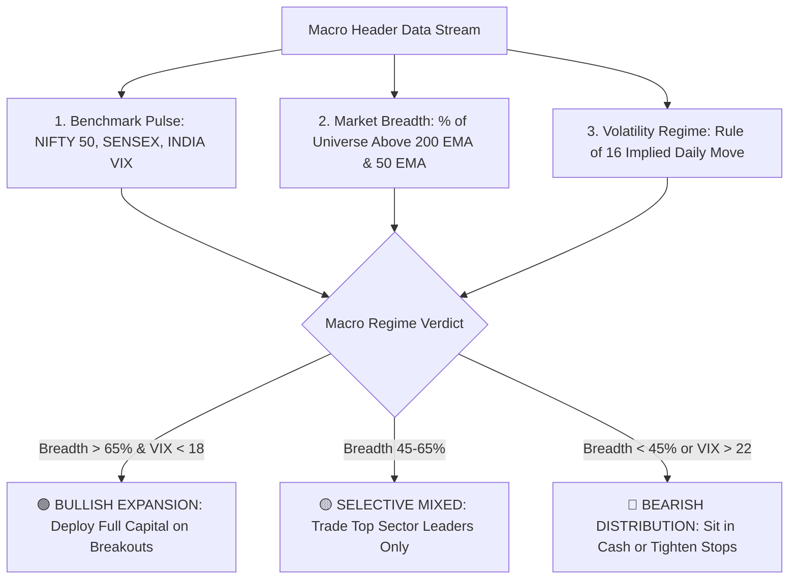
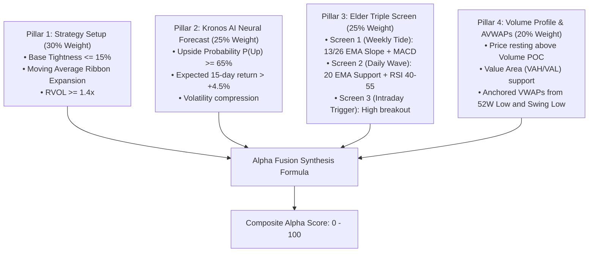
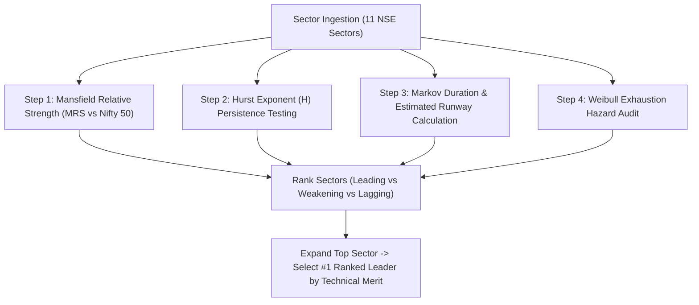
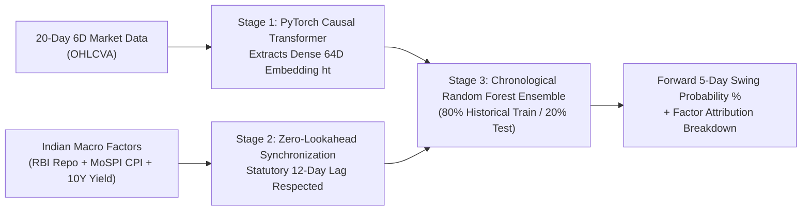
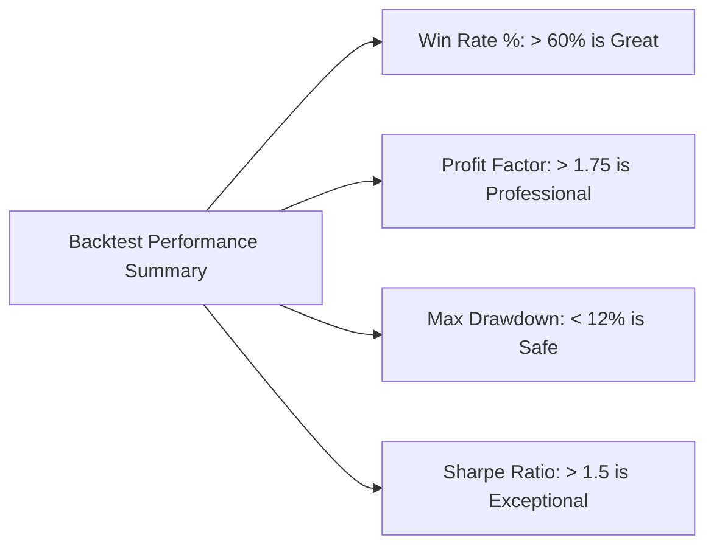
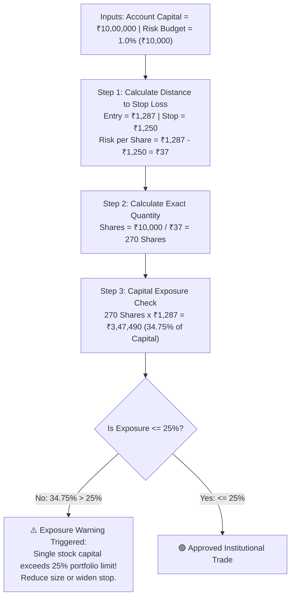

# SwingTradeDesk Pro — Comprehensive End-User Master Guide
### The Complete Practical Handbook: Understanding Every Metric, Value, Threshold & Trading Tool

**Platform Version**: Production 2026 | **Author**: Sandesh Rathi | **Organization**: [rupeemap.in labs](https://www.rupeemap.in)  
**Live URL**: [https://swingtradedeskpro.onrender.com](https://swingtradedeskpro.onrender.com)

---

## 📖 How to Read This Guide

This guide is designed for traders of all experience levels. Every single tool, screen, metric, and algorithm in SwingTradeDesk Pro is explained using a standardized 4-part format:
1. **What is it?** (Plain-English definition)
2. **What does the value mean?** (Quantitative Benchmark Table: 🟢 Good vs 🟡 Neutral vs 🔴 Bad)
3. **Real-World Concrete Example** (Step-by-step numbers, prices, and math)
4. **Actionable Trading Playbook** (Exact rules on when to Buy, Hold, Tighten Stops, or Avoid)

---

## 📑 Master Table of Contents

- [1. Universal "Is It Good or Bad?" Master Cheat Sheet](#1-universal-is-it-good-or-bad-master-cheat-sheet)
- [2. Macro Market Regime & Market Breadth Bar](#2-macro-market-regime--market-breadth-bar)
- [3. Live Quantitative Screener](#3-live-quantitative-screener)
- [4. 360° Stock Deep Scan & Alpha Fusion Studio](#4-360-stock-deep-scan--alpha-fusion-studio)
- [5. Volume Profile (POC / VAH / VAL) & Anchored VWAPs](#5-volume-profile-poc--vah--val--anchored-vwaps)
- [6. Sector Pulse & Constituent Leaderboards](#6-sector-pulse--constituent-leaderboards)
- [7. Kronos AI Foundation Candlestick Forecaster (AAAI 2026)](#7-kronos-ai-foundation-candlestick-forecaster-aaai-2026)
- [8. TradingView Chart Studio](#8-tradingview-chart-studio)
- [9. Walk-Forward Backtest Studio & Indian Tax Model](#9-walk-forward-backtest-studio--indian-tax-model)
- [10. Institutional Risk & Position Sizing Calculator (1% Rule & Half-Kelly)](#10-institutional-risk--position-sizing-calculator-1-rule--half-kelly)
- [11. Paper Trading Journal & Behavioral Analytics](#11-paper-trading-journal--behavioral-analytics)
- [12. AlphaChanakya AI Copilot (Natural Language Tool Execution)](#12-alphachanakya-ai-copilot-natural-language-tool-execution)
- [13. Keyboard Shortcuts & Navigation](#13-keyboard-shortcuts--navigation)

---

## 1. Universal "Is It Good or Bad?" Master Cheat Sheet

Use this master lookup table as a quick-reference guide whenever you are inspecting any metric across the platform:

| Module / Metric | 🟢 Good / Strong Green Light | 🟡 Neutral / Caution | 🔴 Bad / Avoid / Red Light | What It Means in Practice |
| :--- | :--- | :--- | :--- | :--- |
| **Market Breadth (% > 200 EMA)** | **$> 65\%$** (`Bullish Expansion`) | **$45\% - 65\%$** (`Selective Mixed`) | **$< 45\%$** (`Bearish Distribution`) | Percentage of benchmark stocks in macro uptrends. |
| **Market Breadth (% > 50 EMA)** | **$> 60\%$** (Strong short-term fuel) | **$40\% - 60\%$** (Normal chop) | **$< 40\%$** (Broad short-term breakdown) | Short-term intermediate market health. |
| **India VIX (`^INDIAVIX`)** | **$12 - 17$** (Ideal for swing trading) | **$17 - 22$** (Wider price swings) | **$> 22$** (Extreme volatility / Panic) | Implied volatility index. Higher VIX = Wider stop losses required. |
| **Screener Quality Score** | **$80 - 100$** (High institutional setup) | **$60 - 79$** (Valid setup, standard size) | **$< 60$** (Weak setup / High noise) | 0–100 score evaluating base tightness, volume, and MA alignment. |
| **Risk / Reward Ratio (R:R)** | **$\ge 1:2.5$** (Superior asymmetric edge) | **$1:2.0 - 1:2.4$** (Standard minimum) | **$< 1:2.0$** (Sub-optimal / Reject trade) | Mathematical ratio of expected profit to stop loss risk. |
| **Alpha Fusion Score** | **$80 - 100$** (`Triple Screen A+`) | **$60 - 79$** (`Double Screen B+`) | **$< 60$** (`Invalidated / Broken Setup`) | 4-pillar composite score combining Setup, AI, MTF, and Volume POC. |
| **Volume Profile (POC Position)** | **$\text{CMP} > \text{POC}$** (Support below) | **$\text{CMP} \approx \text{POC}$** (Fair Value / Range) | **$\text{CMP} < \text{POC}$** (Heavy overhead supply) | Highest volume traded price level. Acts as an institutional magnet/floor. |
| **Mansfield RS (MRS)** | **$\text{MRS} > 0$ & Rising Slope** | **$\text{MRS} > 0$ & Falling Slope** | **$\text{MRS} < 0$** (Lagging Sector) | Sector outperformance relative to Nifty 50 benchmark. |
| **Hurst Exponent ($H$)** | **$H > 0.55$** (Persistent Trend) | **$H \approx 0.50$** (Random Walk / Chop) | **$H < 0.45$** (Mean Reverting / Anti-Trend) | Econometric memory. $H > 0.55$ means trends sustain and breakouts work. |
| **Estimated Sector Runway** | **$> 15\text{ Days}$** (Youthful trend) | **$6 - 15\text{ Days}$** (Mid-cycle trend) | **$< 5\text{ Days}$** (Aging / Overdue reversal) | Expected statistical remaining days before sector regime exhaustion. |
| **Weibull Exhaustion Hazard** | **$< 30\%$** (Fresh momentum) | **$30\% - 60\%$** (Normal progress) | **$> 65\%$** (High fatigue / Climax risk) | Probability that current sector regime is reaching statistical exhaustion. |
| **Constituent Merit Score** | **$80 - 100$** (Sector Leader #1/#2) | **$60 - 79$** (Follower Stock) | **$< 60$** (Laggard / Weak Relative Strength) | Sector constituent ranking score based on EMAs, RSI, and distance to 52W High. |
| **Kronos AI $P(\text{Up})$** | **$\ge 65\%$** (High probability upside) | **$52\% - 64\%$** (Mild bullish bias) | **$< 50\%$** (Downside skew / Avoid) | Percentage of Monte Carlo future paths finishing above current CMP. |
| **Single Stock Portfolio Exposure**| **$\le 20\%$** (Conservative / Safe) | **$20\% - 25\%$** (Max Permissible Limit) | **$> 25\%$** (⚠️ Over-Concentration Risk) | Total capital allocated to one stock. Must never exceed 25%. |
| **Backtest Profit Factor** | **$> 2.0$** (Exceptional Institutional Edge)| **$1.5 - 2.0$** (Solid Professional Edge) | **$< 1.3$** (Weak edge after taxes/slippage) | Total Gross Profits $\div$ Total Gross Losses across all backtested trades. |

---

## 2. Macro Market Regime & Market Breadth Bar

The top header bar displays real-time macroeconomic health and broad-market participation across the entire Indian stock exchange.



### 1. Market Breadth: `% Above 200 EMA` and `% Above 50 EMA`
* **What is it?**: The percentage of all constituent stocks in the Nifty 500 / Nifty 50 trading above their long-term 200-day Exponential Moving Average (macro trend line) and intermediate 50-day EMA.
* **Why it matters**: Individual stock breakouts fail $>70\%$ of the time when market breadth is deteriorating under the hood. When breadth is expanding, even mediocre setups follow through.

#### Value Benchmark Table:
| Breadth Metric | 🟢 Green Light (Bullish) | 🟡 Yellow Light (Neutral) | 🔴 Red Light (Bearish) |
| :--- | :--- | :--- | :--- |
| **% Above 200 EMA** | **$> 65\%$** (`BULLISH EXPANSION`) | **$45\% - 65\%$** (`SELECTIVE MIXED`) | **$< 45\%$** (`BEARISH DISTRIBUTION`) |
| **% Above 50 EMA** | **$> 60\%$** (Strong short-term push) | **$40\% - 60\%$** (Range-bound market) | **$< 40\%$** (Widespread short-term breakdown) |
| **Breadth Quality Rating** | `BULLISH EXPANSION` | `HEALTHY ACCUMULATION` / `SELECTIVE` | `BEARISH DISTRIBUTION` |

### 2. India VIX & Implied Daily Move
* **What is it?**: India VIX measures annual expected volatility derived from Nifty 50 options pricing.
* **The Rule of 16 Formula**:
  $$\text{Implied Daily Move (\%)} = \frac{\text{India VIX}}{\sqrt{252}} \approx \frac{\text{India VIX}}{15.87}$$

#### Worked Numerical Example:
* **Scenario A (Quiet Bull Market)**: India VIX = $12.50$.
  $$\text{Implied Daily Move} = \frac{12.50}{15.87} = \pm \mathbf{0.79\%}$$
  *Interpretation*: Low turbulence. Tight stop losses ($1.5\times\text{ATR}$) will NOT get whipsawed. Breakouts follow through smoothly.
* **Scenario B (High-Volatility Regime)**: India VIX = $24.00$.
  $$\text{Implied Daily Move} = \frac{24.00}{15.87} = \pm \mathbf{1.51\%}$$
  *Interpretation*: High turbulence. Daily 300+ point swings on Nifty. Breakouts frequently experience deep retests. Widen stop losses to $2.5\times\text{ATR}$ and reduce share quantity by 50%.

---

## 3. Live Quantitative Screener

The **Live Screener** scans across official index universes (`NIFTY_50`, `NIFTY_500`, `BSE_30`, etc.) and filters stocks based on mathematical criteria.

### Understanding the Screener Results Table:

| Column Header | What It Represents | Good / Ideal Value | Bad / Caution Value |
| :--- | :--- | :--- | :--- |
| **Symbol & Name** | Stock ticker on NSE/BSE | Clear liquid names (e.g. `TCS.NS`, `RELIANCE.NS`) | Illiquid penny stocks with wide bid-ask spreads. |
| **CMP & Change** | Live price and today's session % change | Green ($+0.5\%$ to $+3.5\%$) on breakout day | Overextended $>+7\%$ in a single day (chasing risk). |
| **Quality Score** | Multi-factor setup rating ($0–100$) | **$\ge 75/100$** (Clean base, volume dry-up, MA stacked) | **$< 60/100$** (Messy choppy candles, low volume). |
| **Entry Price** | Optimal price level to enter the trade | Resting right at 20 EMA pullback or 52W pivot | Buying $>3\%$ above the defined entry trigger. |
| **Stop Loss** | Structural price level where setup is invalidated | Anchored below swing low or $20\text{ EMA} - 0.5\text{ATR}$ | Arbitrary percentage stop without technical support. |
| **Target 1 (2R)** | First asymmetric profit taking target ($2\times\text{Risk}$) | Provides a $\ge 1:2.0$ Risk/Reward ratio | Less than $1:1.5$ reward. |
| **Target 2 (3R+)**| Extended Stage 2 trend runner target | $1:3.0$ to $1:4.0+$ R/R for remaining 50% shares | N/A |
| **MTF Confluence** | Multi-timeframe trend status (Elder Screen) | `🟢 Weekly Tide Bullish` + `Daily Pullback` | `🔴 Weekly Bearish` (Trading against the higher tide). |
| **Volume POC** | Institutional Point of Control | Price trading **above** POC (POC acts as floor) | Price trapped **below** POC (Heavy overhead resistance). |

### Practical Step-by-Step Trade Execution Example:
1. You run a scan on **NIFTY_50** using the **52-Week High Breakout** strategy.
2. The screener surfaces **BEL.NS (Bharat Electronics)** with:
   - **CMP**: ₹315.00 (+2.1% today)
   - **Quality Score**: **88 / 100** (🟢 *Exceptional*)
   - **Entry Price**: ₹315.50 (Breakout trigger above 4-week base)
   - **Stop Loss**: ₹305.00 (Base pivot low; Risk per share = $₹315.50 - ₹305.00 = ₹10.50$)
   - **Target 1 (2R)**: ₹336.50 (Reward = $+₹21.00$; Risk/Reward = **1:2.0**)
   - **Target 2 (3R)**: ₹347.00 (Reward = $+₹31.50$; Risk/Reward = **1:3.0**)
   - **Volume POC**: ₹308.00 (Resting safely below entry as institutional support).
3. **Action**: Click `[ ⚖️ Size Risk ]` to calculate exact position sizing, then place a GTT (Good-Till-Triggered) order with your broker.

---

## 4. 360° Stock Deep Scan & Alpha Fusion Studio

The **Deep Scan Studio** evaluates any stock across 4 independent quantitative pillars to synthesize a unified **Composite Alpha Score ($0–100$)**.



### The Alpha Fusion Mathematical Formula:
$$\text{Alpha Score} = \text{Regime Multiplier} \times \left[ 0.30(\text{Setup}) + 0.25(\text{Kronos AI}) + 0.25(\text{Elder MTF}) + 0.20(\text{Volume Profile}) \right]$$

### Conviction Tiers & What Sizing to Deploy:

| Alpha Score Tier | Conviction Level | Interpretation | Allowed Position Sizing | Action to Take |
| :---: | :---: | :--- | :---: | :--- |
| **80 – 100** | 🟢 **Triple Screen A+** | All 4 pillars in perfect institutional confluence. Zero structural headwinds. | **100% of Max Risk Budget** (e.g. Full ₹10,000 risk) | **Execute Aggressively**: Set entry, stop loss, and scale out at 2R and 3R. |
| **60 – 79** | 🟡 **Double Screen B+** | Solid trade setup with 3 of 4 pillars aligned (e.g. good price action but AI is neutral). | **75% of Max Risk Budget** (e.g. ₹7,500 risk) | **Execute with Discipline**: Verify $EV/R \ge +0.25R$ before placing order. |
| **< 60** | 🔴 **Invalidated Setup** | Critical contradiction detected (e.g. price below 200 EMA or trapped under heavy Volume POC supply). | **0% (DO NOT TRADE)** | **Pass / Avoid**: Look for cleaner setups on the screener. |

---

## 5. Volume Profile (POC / VAH / VAL) & Anchored VWAPs

Traditional price charts show *what* happened over time. **Volume Profile** reveals *where* institutional money actually transacted.

```
High Price ----------------------------------------------------
                       | | | (Low Volume Node - Fast Move Zone)
Value Area High (VAH) ----------------------------------------- [Top 70% Volume Boundary]
                       | | | | | | | | | | | | | | | | | | | | |
Volume POC (Point of Control) --------------------------------- [🔥 HEAVIEST INSTITUTIONAL VOLUME]
                       | | | | | | | | | | | | | | | | | |
Value Area Low (VAL) ------------------------------------------ [Bottom 70% Volume Boundary]
                       | | | (Low Volume Node - Fast Move Zone)
Low Price -----------------------------------------------------
```

### Key Volume Profile Concepts & How to Interpret Them:

1. **Volume Point of Control (POC)**:
   - **Definition**: The single price level where the highest total volume was traded during the lookback period.
   - 🟢 **Bullish Context ($\text{CMP} > \text{POC}$)**: Price has broken out above the main accumulation zone. When price pulls back to test POC, it acts as **massive institutional support**.
   - 🔴 **Bearish Context ($\text{CMP} < \text{POC}$)**: Price is trapped below the heavy volume zone. Every rally into POC will face intense institutional selling (trapped buyers looking to break even).

2. **Value Area High (VAH) & Value Area Low (VAL)**:
   - **Definition**: The price boundaries containing **70% of total traded volume**.
   - **Trading Rule**: If price breaks out above VAH on $\ge 1.4\times$ volume, it enters a "Volume Imbalance / Low-Volume Zone" where price travels very fast toward new highs with minimal resistance.

3. **Multi-Pivot Anchored VWAPs (AVWAP)**:
   - **52-Week High AVWAP**: The average price paid by all participants since the 52-week peak. In a downtrend, this acts as heavy overhead resistance.
   - **Swing Low Demand AVWAP**: The average price paid by institutional accumulators since the major market bottom. Acts as an institutional dynamic floor.

---

## 6. Sector Pulse & Constituent Leaderboards

Top-down macro analysis proves that **over 50% of an individual stock's move is dictated by its underlying sector trend**. Never buy a stock in a dying sector!



### 1. Mansfield Relative Strength (MRS)
* **Formula**: Compares the sector's performance to the Nifty 50 benchmark smoothed over a 50-day period.
* 🟢 **$\text{MRS} > 0$ and Rising**: Sector is an **Institutional Outperformer**. Capital is flowing into this sector.
* 🔴 **$\text{MRS} < 0$ and Falling**: Sector is an **Underperformer / Laggard**. Capital is rotating out.

### 2. Hurst Exponent ($H$) — Market Memory
* **What is it?**: An econometric measure of time-series autocorrelation and trending persistence ($0.0$ to $1.0$).
* **Value Thresholds**:
  * 🟢 **$H > 0.55$ (Persistent Trending Regime)**: Trend has strong statistical memory. Breakout and trend-following strategies have a $>65\%$ win rate.
  * 🟡 **$H \approx 0.50$ (Random Walk / Brownian Noise)**: No memory. Directional momentum is unpredictable.
  * 🔴 **$H < 0.45$ (Anti-Persistent / Mean Reverting)**: Price violently chops back and forth. Breakout strategies will fail; only trade extreme oversold bounces.

### 3. Estimated Runway & Exhaustion Hazard
* **The Runway Formula**:
  $$\text{Estimated Runway (Days)} = \text{Historical Markov Expected Duration} - \text{Current Regime Age}$$
* **Worked Example (NIFTY AUTO)**:
  - Historical Average Bull Regime Length: $28\text{ Days}$
  - Current Regime Age: $11\text{ Days}$
  - **Estimated Runway**: $$28 - 11 = \mathbf{17\text{ Days Remaining}}$$
  - **Weibull Exhaustion Hazard**: $22\%$ (Low fatigue / Fresh trend).
  - **Verdict**: 🟢 **Green Light**! You have 17 trading days of statistical runway to ride swing trades in Auto stocks.

### 4. Technical Merit Score ($10–100$) for Constituents
When you expand a leading sector card, the constituents are ranked by their **Technical Merit Score**:
* **Score 85–100**: Absolute Sector Leader (e.g. *Bajaj Auto* or *M&M*). Price is $>5\%$ above 20 EMA, RSI is in sweet spot ($60–68$), and Weinstein Stage is Stage 2.
* **Score 65–84**: Secondary Follower (e.g. *TVS Motor*). Solid setup.
* **Score < 60**: Sector Laggard (e.g. *Maruti Suzuki* in Stage 4). **Avoid buying laggards even in a strong sector**!

---

## 7. Kronos AI Foundation Model & Macro-Factor Alignment Studio

The AI Forecast workspace contains two independent institutional workflows:
1. **🔮 K-Line Candlestick Forecaster**: Autoregressive multi-path Monte Carlo price trajectory simulation.
2. **🏛️ Macro-Factor Alignment Studio**: PyTorch Causal Transformer embeddings fused with zero-lookahead Indian macroeconomic data (RBI Repo Rate, MoSPI CPI Inflation, 10Y Sovereign Yield, USD/INR).

---

### 7.1 K-Line Candlestick Forecaster (AAAI 2026)

**Kronos** is an autoregressive foundational transformer trained on 12B+ candlestick tokens across global financial markets. It generates 20 to 30 parallel Monte Carlo future price paths for any stock over the next 15 trading days.

```
Future Day:   T+1      T+5        T+10       T+15
Price (₹)
 ₹2,500 ------------------------------------ [p90 Upper Corridor: ₹2,480]
                \       / \        / \
 ₹2,400 --------- \ - - - - \ - - - - \ ---- [Median AI Target: ₹2,410]
                   \ /       \ /       \
 ₹2,300 ------------------------------------ [CMP: ₹2,342]
                      \     /
 ₹2,200 ------------------------------------ [p10 Lower Corridor: ₹2,260]
```

#### How to Interpret K-Line AI Metrics:

| AI Output Metric | 🟢 Bullish / Safe | 🟡 Neutral | 🔴 Bearish / High Risk |
| :--- | :--- | :--- | :--- |
| **Upside Probability $P(\text{Up})$** | **$\ge 65\%$** (Strong upside density) | **$50\% - 64\%$** (Mild positive lean) | **$< 50\%$** (Downside probability dominates) |
| **Expected 15-Day Return** | **$> +4.0\%$** expected capital gain | **$+1.0\%$ to $+3.9\%$** | **$\le 0.0\%$** (Flat or negative trajectory) |
| **90% Confidence Corridor $[p_{10}, p_{90}]$**| Target 1 is well inside $p_{90}$ | Target 1 touches $p_{90}$ | Stop loss is inside tight $p_{10}$ range |
| **Volatility Amplification Factor** | **$< 0.90\times$** (Coiling for breakout)| **$0.90\times - 1.30\times$** (Normal) | **$> 1.60\times$** (Extreme erratic turbulence) |

---

### 7.2 Two-Stage Macro-Factor Alignment Studio (Kronos + RBI Macro)

This institutional pipeline solves the fundamental disconnect between **daily equity price action** and **monthly macroeconomic policy cycles** with **strict zero-lookahead bias**.



#### Understanding the Macro HUD & Alignment Metrics:

| Macro & Alignment Metric | Value Meaning | Trading Interpretation & Action |
| :--- | :--- | :--- |
| **RBI Repo Rate (%)** | Monetary policy benchmark rate (e.g. 5.75% / 6.50%). | Rate cuts / pauses expand equity valuation multiples and spur swing breakout momentum. |
| **MoSPI CPI Inflation (%)** | Official Consumer Price Index (Target: $4.0\% \pm 2\%$). | Inflation cooling towards $<4.5\%$ signals macroeconomic stability and favorable holding environments. |
| **Zero-Lookahead Verification** | Strict backward-looking publication lag enforcement. | Guarantees the model never trains on unannounced economic data, ensuring authentic backtest integrity. |
| **Forward Breakout Probability** | Likelihood of stock gaining $> +0.5\%$ over next $5$ trading days. | **$\ge 65\%$ (🟢 Strong Green Light)**; **$50\%-64\%$ (🔵 Selective)**; **$<40\%$ (🔴 Avoid/Defensive)**. |
| **Factor Attribution Breakdown** | Relative contribution of Technical Embeddings vs Macro Factors. | Dissects whether a stock's edge is propelled by pure price coiling ($h_t$) or macroeconomic liquidity tailwinds. |

---

---

## 8. TradingView Chart Studio

The **Chart Studio** is engineered with lightweight TradingView canvas charting to give you an institutional multi-timeframe view.

### Moving Average Color Codes & Roles:
* 🔵 **Cyan Line (20 EMA)**: Short-term momentum anchor. In a strong Stage 2 markup, price rides above the 20 EMA and repeatedly bounces off it on light volume pullbacks.
* 🟠 **Amber Line (50 EMA)**: Institutional trend benchmark. Mutual funds and institutional desks defend the 50 EMA on multi-week corrections.
* 🟣 **Purple Line (200 EMA)**: The macro baseline dividing Bull Markets ($\text{Price} > 200\text{ EMA}$) from Bear Markets ($\text{Price} < 200\text{ EMA}$).

### RSI(14) Multi-Zone Interpretation:
* **Zone 1: $70 - 100$ (Overbought)**: Strong momentum, but do NOT buy new breakout entries here. Trail your stop loss using a Chandelier 2.5x ATR trailing stop.
* **Zone 2: $40 - 55$ (The Pullback Sweet Spot)**: In an established uptrend, RSI cooling off into the 40–55 range while price rests on the 20 EMA is the **highest-probability entry zone in swing trading**.
* **Zone 3: $< 35$ (Oversold)**: Extreme selling exhaustion. Only buy if price is in a long-term macro bull trend (Connors RSI(2) setup).

---

## 9. Walk-Forward Backtest Studio & Indian Tax Model

Before trading any strategy with real money, you must verify its historical statistical expectancy and drawdown profile.

### Realistic Indian Transaction Cost Model:
Unlike simplistic backtesters that report unrealistic 500% returns, SwingDesk Pro includes realistic Indian exchange friction:
* **Securities Transaction Tax (STT)**: $0.1\%$ on delivery buy & sell turnover.
* **Exchange Turnover Fees & SEBI Charges**: NSE/BSE clearing rates.
* **Brokerage**: Fixed ₹20 per trade (or $0.05\%$).
* **GST**: $18\%$ on brokerage and turnover costs.
* **Execution Slippage**: $0.08\%$ average bid-ask fill drag.

### Evaluating Backtest Metrics:



#### Metric Benchmark Table:
| Performance Metric | 🟢 Exceptional Edge | 🟡 Acceptable Professional Edge | 🔴 Unviable / Failed System |
| :--- | :--- | :--- | :--- |
| **Win Rate %** | **$> 65\%$** (High consistency) | **$48\% - 65\%$** (Standard swing trend) | **$< 40\%$** (Too low unless R:R $> 1:4$) |
| **Profit Factor** | **$> 2.00$** | **$1.50 - 1.99$** | **$< 1.25$** (Will lose money after taxes) |
| **Max Drawdown %** | **$< 10.0\%$** (Smooth equity curve) | **$10.0\% - 18.0\%$** (Normal volatility) | **$> 22.0\%$** (Severe psychological pain) |
| **Sharpe Ratio** | **$> 1.60$** | **$1.00 - 1.59$** | **$< 0.80$** (Poor risk-adjusted return) |
| **Payoff Ratio (Avg Win $\div$ Avg Loss)** | **$> 2.50\text{R}$** | **$1.80\text{R} - 2.49\text{R}$** | **$< 1.20\text{R}$** (Negative expectancy) |

---

## 10. Institutional Risk & Position Sizing Calculator (1% Rule & Half-Kelly)

Position sizing is the **only variable in trading that is 100% under your control**.



### Complete Sizing Math Walkthrough:
* **Account Capital**: `₹10,00,000`
* **Risk Budget**: `1.0%` ($\implies \text{Total Risk} = \mathbf{₹10,000}$)
* **Stock**: Reliance Industries (`RELIANCE.NS`)
  - **Entry Price**: `₹1,287.00`
  - **Stop Loss**: `₹1,250.00` (Technical swing low support)
  - **Risk per Share**: $$₹1,287.00 - ₹1,250.00 = \mathbf{₹37.00}$$
* **Calculated Quantity**:
  $$\text{Shares} = \left\lfloor \frac{₹10,000}{₹37.00} \right\rfloor = \mathbf{270\text{ Shares}}$$
* **Capital Invested**: $$270 \times ₹1,287.00 = \mathbf{₹3,47,490.00}$$
* **Targets & Projected Profits**:
  - **Target 1 ($2\text{R}$ at ₹1,361.00)**: Profit = $270 \times ₹74.00 = \mathbf{+₹19,980.00}$ ($+2.0\%$ portfolio gain).
  - **Target 2 ($3\text{R}$ at ₹1,398.00)**: Profit = $270 \times ₹111.00 = \mathbf{+₹29,970.00}$ ($+3.0\%$ portfolio gain).
* **Exposure Warning**:
  - Because $₹3,47,490$ is **$34.75\%$** of total capital ($>25\%$ max limit), the platform flags a yellow exposure warning.
  - *Trader Adjustment*: Reduce risk to $0.7\%$ or cap position at ₹2,50,000 (194 shares) to maintain diversification.

---

## 11. Paper Trading Journal & Behavioral Analytics

The **Paper Trading Journal** bridges the gap between theoretical knowledge and real-time execution discipline.

### How to Manage Trades in the Journal:
1. **1-Click Logging**: Click `[ 📝 Log Trade ]` on any stock card in the Screener, Deep Scan, or Sector Pulse.
2. **Live Mark-to-Market P&L**: The journal connects to the live data engine and continuously recalculates your unrealized P&L in ₹ and %.
3. **Closing a Position**:
   - When closing a trade, select one of the standardized institutional exit reasons:
     - 🟢 **`Target 1 Hit`** (Booked $+2\text{R}$ profit).
     - ❇️ **`Target 2 Hit`** (Rode full Stage 2 trend for $+3\text{R}$ to $+4\text{R}$).
     - 🔵 **`Trailing Stop Hit`** (Exited above entry price on momentum exhaustion).
     - 🔴 **`Stop Loss Hit`** (Disciplined $-1\text{R}$ exit on structural invalidation).
     - ⚪ **`Time Invalidation`** (Stock went sideways for $>15$ days with zero progress).
4. **Reviewing Behavioral Analytics**:
   - **Win Rate %**: Target $\ge 55\%$.
   - **Average R-Multiple**: Target $\ge +1.50\text{R}$ across all closed trades.
   - **Profit Factor**: Gross Gains $\div$ Gross Losses (Target $\ge 1.75$).

---

## 12. AlphaChanakya AI Copilot (Natural Language Tool Execution)

**AlphaChanakya** is not just a chatbot—it is an **autonomous terminal agent** with 8 native tool execution methods.

```
       🏛️ AlphaChanakya AI Execution Engine
                   |
 -------------------------------------------------------------
 |                      |                      |             |
Screener Engine     Deep Scan Engine    Kronos AI Engine   Risk Engine
[tool_scan_screener] [tool_deep_scan]   [tool_kronos]      [tool_calculate]
```

### Complete Prompt Cheat-Sheet for AlphaChanakya:

| Desired Action | Example Prompt to Type in Chat | What AlphaChanakya Executes |
| :--- | :--- | :--- |
| **Live Price & Levels** | *"what is stock price TCS today?"* | Pulls live CMP, 20/50/200 EMAs, RSI, ATR, and 52W range from DataEngine. |
| **Support & Resistance** | *"what are key levels for Reliance?"* | Cites exact EMA dynamic levels, 52W extremes, and Weinstein stage. |
| **Run Live Screener** | *"scan Nifty 50 for 52-week high breakouts"* | Executes `tool_scan_screener` and outputs top setups with entry/stop/targets. |
| **Deep Scan & Alpha Fusion** | *"give me a deep scan on Tata Motors"* | Executes `tool_deep_scan_stock` and reports 4-pillar Alpha Fusion score (0-100). |
| **AI Neural Forecast** | *"forecast TCS for the next 15 days"* | Executes `tool_kronos_ai_forecast` and reports $P(\text{Up})$ and $[p_{10}, p_{90}]$ corridor. |
| **Walk-Forward Backtest** | *"backtest Connors RSI(2) on TCS for 2 years"* | Executes `tool_run_backtest` and outputs Win Rate %, Profit Factor, and CAGR %. |
| **Position Sizing Math** | *"calculate risk for ₹10L capital buying Reliance at 1287 with 1250 stop"* | Executes `tool_calculate_position_size` and returns exact 270 shares and exposure audit. |
| **Sector Rotation** | *"who are the top constituent leaders in Nifty Auto?"* | Executes `tool_get_sector_constituents` and returns ranked leaderboard by Merit Score. |
| **Log Paper Trade** | *"log a paper trade for 200 shares of SBIN at 810 with 790 stop"* | Executes `tool_log_paper_trade` directly into SQLite paper journal. |

---

## 13. Keyboard Shortcuts & Navigation

| Key / Hotkey | Action / Destination |
| :---: | :--- |
| `?` | Opens the In-App Centralized Knowledge Base & Jargon Dictionary. |
| Click `[ 🏛️ AlphaChanakya ]` | Opens the AI Copilot Assistant slide-over drawer on the right. |
| Click Index Chip (`NIFTY 50` / `VIX`) | Opens Macro Market Regime & Volatility diagnostic drawer. |
| Click `[ 📈 ]` in Table | Jumps directly to Chart Studio with pre-drawn technical lines. |
| Click `[ 🔬 ]` in Table | Opens 360° Alpha Fusion Deep Scan for that stock. |
| Click `[ ⚖️ ]` in Table | Pre-fills entry and stop loss into Risk & Position Sizing Calculator. |
| Click `[ 📝 ]` in Table | Instantly logs setup into Paper Trading Journal. |

---

## 📜 Authors & Copyright

* **Engineered & Designed by**: [Sandesh Rathi](https://github.com/srathi)
* **Organization**: [rupeemap.in labs](https://www.rupeemap.in)
* **License**: MIT License
